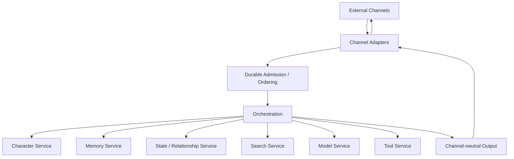
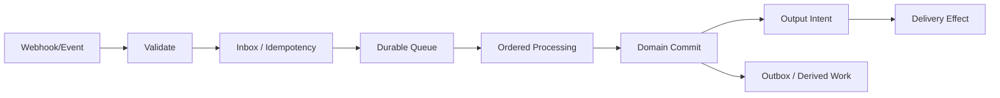
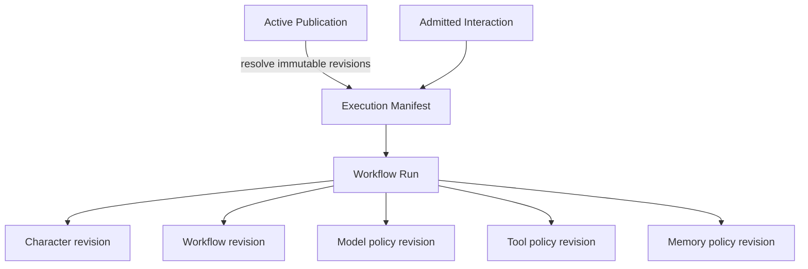
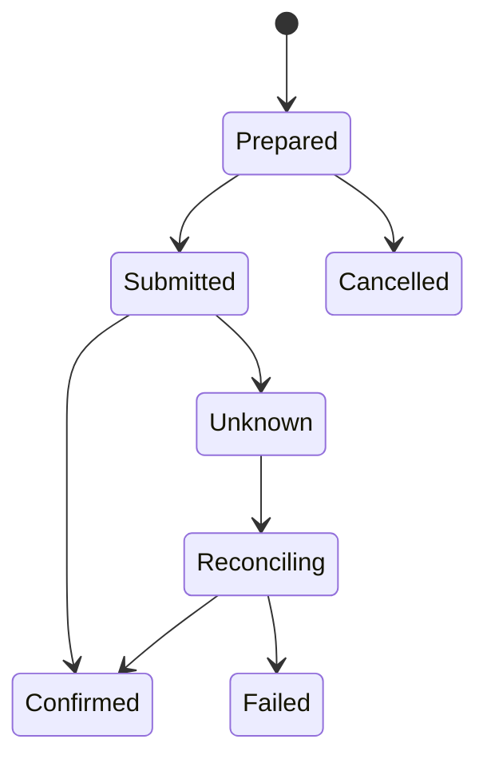
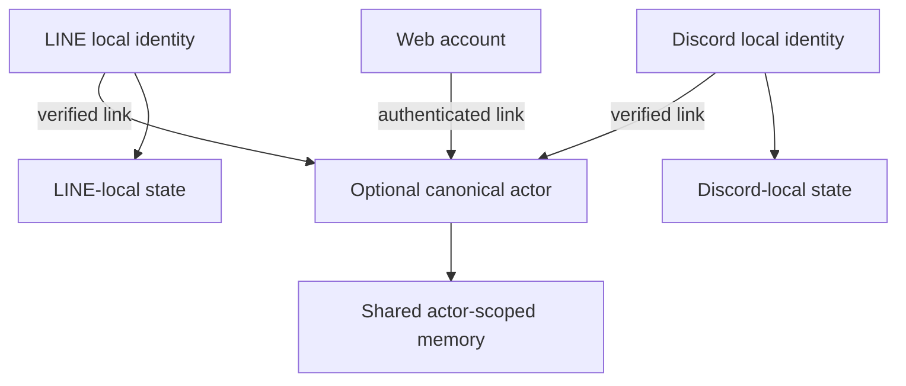
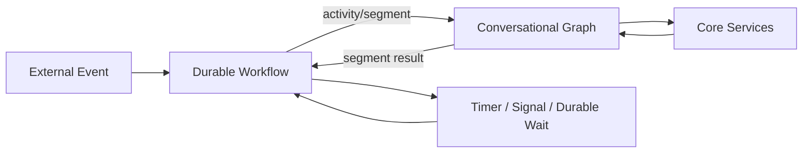
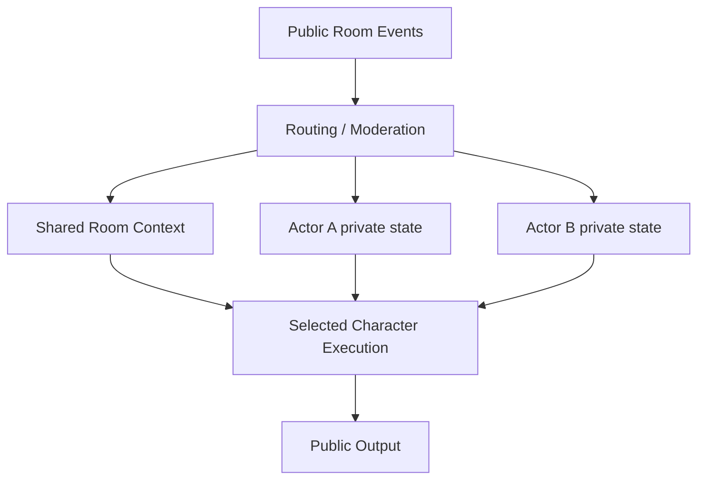
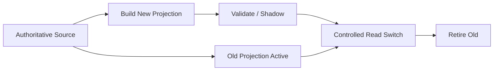
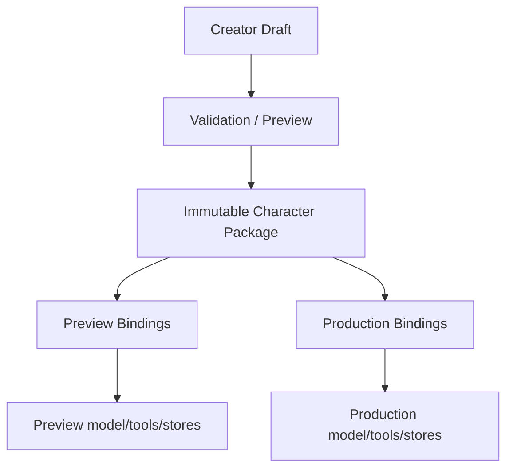
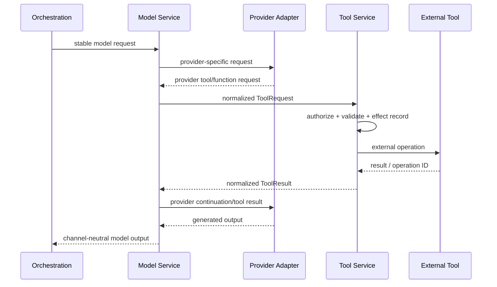

# Roidoya Character Chat Platform — Architecture and Technical Disclosure

**Status:** First Public Edition  
**Edition:** 2026-08-09  
**Publication date:** 2026-08-09 (Asia/Tokyo)  
**Author:** Akihiro Fujimoto  
**Project:** Roidoya Character Chat Platform (RCCP)  
**Canonical repository:** `AkihiroFujimotoChocolate/roidoya-character-platform`  
**Canonical path:** `docs/publications/rccp-architecture-and-technical-disclosure.md`  
**License:** MIT License, consistent with the repository license unless otherwise stated

## Abstract

Roidoya Character Chat Platform (RCCP) is an engineering architecture for building and operating production character-chat services across multiple interaction channels while keeping channel transport, character behavior, durable continuity, orchestration, model access, tools, and operational controls replaceable and independently evolvable. This document specifies implementable responsibility boundaries, stable interaction contracts, creator-editable workflow publication, persistent memory and relationship state, multi-instance ordering and idempotency, recoverable external effects, replay and migration, provider-neutral model/tool mediation, cross-channel identity, public-room continuity, and multiple concrete implementations using workflow engines, managed cloud services, messaging platforms, queues, and model APIs. It includes complete processing embodiments, alternative implementations, state machines, technical combinations, and functional figures.

**Keywords:** character chat platform; conversational agent; channel adapter; durable workflow; creator-editable workflow; immutable publication revision; character memory; relationship state; idempotent webhook processing; conversation ordering; effect journal; cross-channel identity; provider-neutral model service; tool mediation; live-chat character system; derived-state migration; execution provenance

> This document describes implementable technical architectures and embodiments for building and operating character-chat services with RCCP. It includes both implemented and not-yet-implemented arrangements. A described embodiment does not imply that it is currently implemented, selected as the only supported architecture, or claimed to be novel.

## 1. Purpose and scope

Roidoya Character Chat Platform (RCCP) is an engineering platform for building, operating, validating, and continuously improving production-quality character-chat services while reusing common technical foundations.

The current focus is text-based character interaction. The architecture is intentionally designed so that additional interaction forms, content parts, channels, tools, state models, memory models, and model providers can be added without requiring unrelated parts of a service to be redesigned.

This disclosure focuses on technical arrangements for:

- separating external-channel concerns from channel-independent character behavior;
- composing character experiences through orchestration;
- exposing reusable character-related capabilities as replaceable services or modules;
- maintaining continuity across interactions through memory, relationship state, workflow state, event state, or combinations of them;
- preserving stable contracts while allowing implementations and infrastructure to change;
- maintaining correctness in horizontally scaled or multi-instance deployments;
- controlling duplicate processing, concurrency, backlog, rate limits, and external-provider failures;
- allowing content creators to modify character-specific experience flows without requiring infrastructure changes;
- keeping development and production execution paths sufficiently aligned to reduce environment-specific behavior;
- providing concrete and alternative implementation forms rather than requiring a single deployment topology, storage product, workflow engine, or model provider.

RCCP does not require every deployment to use every component described here. Components may be combined, omitted, replaced, embedded in another process, or deployed independently when the resulting arrangement preserves the required responsibility and contract boundaries.

## 2. Technical problems addressed

Production character-chat systems repeatedly encounter technical problems that are not solved merely by connecting a user interface to a language model.

Representative problems include:

1. **Channel-specific behavior leaks into character logic.** LINE, Web, Discord, Slack, and other channels differ in authentication, event delivery, identifiers, message limits, retries, reply semantics, batching, rate limits, and transport behavior.
2. **Character behavior becomes tightly coupled to one model provider or prompt call.** Replacing a model, adding retrieval, introducing tools, or changing memory behavior then requires large application changes.
3. **Long-lived character experiences require several kinds of continuity.** Conversation history alone may be insufficient for durable memory, relationship progression, story state, scheduled events, quests, or character-side state.
4. **Content changes and infrastructure changes have different owners and cadences.** Character creators may need to adjust experience logic while developers and operators retain control of deployment, security, resource boundaries, and shared services.
5. **Distributed execution introduces correctness failures.** Duplicate webhooks, retries, concurrent messages, multiple worker replicas, expired reply tokens, queue backlogs, provider throttling, and partial failures can produce duplicate or contradictory character behavior.
6. **Interfaces outlive implementations.** Services, providers, databases, workflow engines, and deployment environments may change while existing channels and content should continue operating.
7. **Local-only substitutes can hide production failures.** An application that uses in-memory queueing, locking, or state in development may exercise materially different execution paths from its production deployment.
8. **Character services need operational boundaries.** Cost, tool access, model access, data access, timeouts, concurrency, and resource use need explicit limits that can be enforced without embedding every limit into character content.

The disclosed architecture addresses these problems through explicit responsibility boundaries, stable contracts, replaceable implementations, orchestration, shared reliability mechanisms, and concrete failure-handling rules.

## 3. Terminology

### 3.1 Channel

An external interaction surface or transport through which an end user or external system exchanges events with a character service. Examples include LINE, a Web application, Discord, Slack, another messaging platform, or an application-specific protocol.

### 3.2 Channel Adapter

A component responsible for channel-specific ingress and egress behavior. It converts external events into a channel-neutral internal representation and converts internal outputs into channel-specific responses.

### 3.3 Orchestration

The execution layer that composes reusable capabilities into a character-specific interaction flow. Orchestration may include sequential execution, branching, parallel work, retries, waiting, asynchronous work, schedules, event handling, and durable long-running workflows.

### 3.4 Core Service

A reusable channel-independent capability invoked by orchestration or by another core service. Examples include Character, Memory, State/Relationship, Model, Search, and Tool services.

A core service is a logical responsibility. It does not have to be a separately deployed network service.

### 3.5 Character definition

Versioned configuration and content that define character-specific behavior or references to such behavior, such as identity, behavioral instructions, speaking style, model policy, memory policy, workflow reference, tool permissions, safety constraints, or content references.

### 3.6 Continuity state

Persistent information that can affect later interactions. Continuity state may include conversation history, durable memory, relationship state, workflow state, event state, story or quest progression, character state, or other service-defined state.

### 3.7 Stable contract

A message, API, event, or data interface intended to survive implementation changes. Stable contracts are versioned or evolved using compatibility rules so callers do not need to change whenever an implementation is replaced.

### 3.8 Reference embodiment

A concrete, implementable arrangement that demonstrates how the architecture can be realized. A reference embodiment is not the only permitted arrangement.

## 4. Logical architecture

The backend responsibilities are organized around three principal logical areas:

```text
External Channels
        |
        v
+------------------+
| Channel Adapters |
+------------------+
        |
        v
+------------------+
|  Orchestration   |
+------------------+
        |
        v
+------------------+
|  Core Services   |
+------------------+
        |
        v
Persistent State / External Providers / Infrastructure
```

This is a logical responsibility model, not a mandatory physical deployment model.

A deployment may place multiple areas in one process for simplicity, or may deploy individual components independently for scaling, security, failure isolation, technology choice, or release independence.

### 4.1 Responsibility rule

Channel-specific concerns should terminate at a Channel Adapter unless a downstream capability genuinely needs channel metadata.

Character behavior, memory policy, relationship progression, model selection, retrieval policy, and reusable tools should not depend directly on LINE reply tokens, Discord interaction IDs, HTTP cookies, or equivalent transport-specific mechanisms.

When downstream logic needs limited channel context, the adapter conveys normalized metadata rather than exposing the complete transport API as a platform-wide dependency.

## 5. Channel Adapters

A Channel Adapter may perform the following functions:

- receive webhook requests, socket messages, HTTP requests, or other channel events;
- validate signatures, tokens, authentication, or origin-specific security properties;
- reject malformed input before it enters character processing;
- filter unsupported event types;
- derive normalized conversation and actor identifiers;
- retain channel-specific correlation data required for later replies;
- translate external message payloads into a common interaction contract;
- apply channel-specific size, timing, batch, or reply constraints;
- serialize outputs into channel-specific response objects;
- call the channel's reply or send API;
- handle channel retry or redelivery behavior;
- implement channel-specific rate or quota controls;
- expose channel-specific telemetry while propagating platform-wide correlation identifiers.

### 5.1 Normalization boundary

A channel event can be normalized into an internal interaction with at least:

- a request or correlation identifier;
- an optional upstream event identifier;
- an origin or channel label;
- a conversation identifier;
- an actor identifier;
- a target character identifier when applicable;
- one or more content parts;
- selected normalized metadata;
- processing limits or deadlines when applicable.

The adapter may retain opaque channel-specific reply data outside the normalized interaction, for example by storing it in a work item or correlation record that is consumed by the same adapter's outbound path.

### 5.2 Alternative adapter placements

The following are all valid embodiments:

- one independently deployed adapter per channel;
- multiple channel adapters in one process with separate endpoints;
- a shared ingress process with channel-specific adapter modules;
- serverless functions for individual channels;
- an embedded Web adapter inside a larger Web application;
- an adapter that publishes normalized interactions to a durable queue;
- an adapter that invokes orchestration synchronously when the channel's timing constraints allow it.

The key requirement is preservation of the channel-specific responsibility boundary, not a specific process topology.

Section 50 gives concrete mappings for several external communication services. Naming an external service in those embodiments identifies an integration target and its public API constraints; it does not make that service a platform-wide dependency.

## 6. Orchestration

Orchestration composes character-specific experiences using reusable capabilities.

A single interaction may execute a flow such as:

```text
Receive normalized interaction
        |
        v
Load character revision
        |
        v
Load selected continuity state
        |
        v
Evaluate workflow conditions
        |
        +--> optional retrieval/search
        |
        +--> optional tool calls
        |
        +--> optional state transition
        |
        v
Build model input
        |
        v
Generate candidate output
        |
        v
Validate/transform output
        |
        +--> write memory
        +--> update relationship/state
        +--> emit event/schedule continuation
        |
        v
Return channel-neutral output
```

This flow is an example. Steps may be skipped, reordered where semantics permit, executed in parallel, retried, delegated, or resumed later.

### 6.1 Workflow capabilities

An orchestration implementation may support:

- sequential steps;
- conditional branches;
- parallel branches;
- fan-out and fan-in;
- retries with bounded policies;
- compensation or rollback actions;
- asynchronous activities;
- event-driven continuation;
- timer or scheduled continuation;
- wait and resume;
- durable long-running workflows;
- human or creator approval steps;
- sub-workflows;
- reusable workflow templates;
- per-character workflow customization.

### 6.2 Existing workflow engines

RCCP does not require a proprietary workflow runtime or RCCP-specific workflow language.

One embodiment uses an existing workflow engine or durable-workflow system and integrates RCCP capabilities as activities, tasks, workers, HTTP services, functions, or plugins.

Another embodiment uses ordinary application code for short synchronous flows and introduces a workflow engine only when waiting, retry persistence, long-running execution, schedules, or creator editing justify it.

A third embodiment combines both: application code implements low-latency steps while a durable engine coordinates long-lived state transitions.

Section 49 gives concrete RCCP mappings for several existing orchestration runtimes. Those mappings are alternative embodiments, not a requirement that RCCP select one universal engine.

### 6.3 Content creator boundary

Orchestration is a principal boundary at which character-specific experiences can be designed or changed by content creators.

A system can expose different editing surfaces over the same execution model:

- forms for common settings;
- reusable templates for common interaction patterns;
- a graphical workflow editor;
- declarative YAML/JSON workflow definitions;
- code-based workflows;
- an advanced editor exposing the workflow engine's native representation;
- a restricted creator-facing view with developer-controlled capabilities.

A production system may require review, validation, preview, approval, versioning, staged rollout, or rollback before a creator-edited workflow becomes active.

## 7. Core Services

Core Services provide reusable channel-independent capabilities. The following list is illustrative rather than exhaustive.

### 7.1 Character Service

A Character Service can:

- resolve a character by identifier;
- resolve an immutable or versioned revision;
- provide behavioral instructions and style constraints;
- provide references to workflows, memories, knowledge, tools, assets, or policies;
- support staged or published revisions;
- expose metadata required by other services without exposing creator-only editing data to runtime callers.

A concrete character definition may use a structure such as:

```json
{
  "character_id": "char:alice",
  "revision": "2026-08-09T01:00:00Z",
  "display_name": "Alice",
  "behavior": {
    "instructions_ref": "content://characters/alice/instructions",
    "style_ref": "content://characters/alice/style"
  },
  "workflow_ref": "workflow://character-chat/default",
  "model_policy_ref": "policy://models/default-chat",
  "memory_policy_ref": "policy://memory/long-term-v2",
  "tool_policy_ref": "policy://tools/alice-default"
}
```

The references may instead be embedded documents, database keys, Git revisions, object-storage URIs, package references, or service-specific identifiers.

### 7.2 Memory Service

A Memory Service persists and retrieves information intended to affect later interactions.

Possible memory classes include:

- raw interaction history;
- rolling summaries;
- extracted facts;
- user preferences;
- character observations;
- episodic events;
- semantic memories stored with embeddings;
- manually curated memories;
- memories scoped to a character, actor, conversation, group, account, or service.

A memory record can include:

```json
{
  "memory_id": "mem:01J...",
  "scope": {
    "character_id": "char:alice",
    "actor_id": "user:123"
  },
  "kind": "episodic",
  "content": "The user said they plan to visit Kyoto next month.",
  "source_event_id": "evt:abc",
  "created_at": "2026-08-09T01:23:45Z",
  "importance": 0.62,
  "expires_at": null,
  "metadata": {}
}
```

A different implementation may avoid normalized memory records entirely and instead use conversation summaries, vector retrieval, an event log, a graph representation, or provider-managed memory. The orchestration contract should allow the memory implementation to be replaced without forcing a channel adapter rewrite.

### 7.3 State / Relationship Service

A State or Relationship Service stores structured state that is better represented as explicit fields or transitions than as natural-language memory.

Examples include:

- relationship level;
- trust or affinity values;
- quest or story progression;
- unlocked topics;
- event completion flags;
- character mood or mode;
- cooldowns;
- counters;
- feature eligibility;
- per-user or per-conversation state machines.

A state record may be versioned for optimistic concurrency:

```json
{
  "state_key": "relationship:char:alice:user:123",
  "version": 42,
  "values": {
    "affinity": 18,
    "chapter": "chapter-3",
    "flags": ["met_at_station", "received_key"]
  },
  "updated_at": "2026-08-09T01:25:00Z"
}
```

Relationship state may be a separate service, a namespace within a general State Service, part of a Character Runtime, or encoded as workflow state. These are alternative embodiments.

### 7.4 Model Service

A Model Service isolates model-provider selection and invocation from character workflows.

It may provide:

- provider routing;
- model selection by policy;
- prompt or message transformation;
- timeout and retry policy;
- token or cost budgets;
- streaming or non-streaming generation;
- structured output validation;
- fallback providers or models;
- safety-policy integration;
- provider-specific telemetry;
- caching when semantically appropriate.

A workflow can request a capability such as `generate character response` without embedding a provider-specific HTTP request in the workflow definition.

An alternative embodiment allows the workflow to invoke providers directly but localizes provider-specific details in reusable workflow activities or libraries.

### 7.5 Search Service

A Search Service may expose retrieval over:

- character lore;
- service documentation;
- user-authorized data;
- conversation archives;
- structured databases;
- vector indexes;
- full-text indexes;
- knowledge graphs;
- external search providers.

Search can be called explicitly by a workflow, selected by a model/tool loop, or triggered by a policy based on message classification.

### 7.6 Tool Service

A Tool Service exposes controlled external capabilities such as:

- application APIs;
- game actions;
- calendar or scheduling actions;
- content lookup;
- purchases or account actions where authorized;
- device control;
- internal business operations;
- arbitrary service-specific functions.

The tool boundary can enforce authentication, authorization, allow-lists, parameter validation, rate limits, cost limits, audit logging, and side-effect confirmation independently of model-provider behavior.

## 8. Stable interaction contract

Service-to-service messages should be treated as long-lived contracts.

Where existing message concepts are sufficient, implementations should prefer conventional concepts such as `message`, `role`, and `content` rather than inventing unnecessary RCCP-specific vocabulary.

The internal contract should not be fixed to one model provider's API.

### 8.1 Reference interaction envelope

One implementable contract is:

```json
{
  "request_id": "req:01J...",
  "event_id": "line:event:abc",
  "origin": {
    "platform": "line",
    "channel_instance": "official-account:primary"
  },
  "conversation": {
    "id": "conversation:xyz"
  },
  "author": {
    "id": "actor:123"
  },
  "character": {
    "id": "char:alice"
  },
  "message": {
    "role": "user",
    "content": [
      {
        "type": "text",
        "text": "Hello"
      }
    ]
  },
  "limits": {
    "deadline_ms": 20000,
    "max_output_messages": 5,
    "max_chars_per_message": 1000
  },
  "metadata": {}
}
```

The initial text-focused implementation can simplify `content` to a string. A later compatible version can introduce multiple content parts such as text and images.

### 8.2 Reference output envelope

A corresponding output may be:

```json
{
  "request_id": "req:01J...",
  "status": "ok",
  "messages": [
    {
      "role": "assistant",
      "content": [
        {
          "type": "text",
          "text": "Hello. Good to see you again."
        }
      ]
    }
  ],
  "effects": {
    "memory_writes": [],
    "state_updates": [],
    "events": []
  },
  "metadata": {}
}
```

Another embodiment keeps memory/state/event effects internal to orchestration and returns only user-visible messages. Both arrangements are disclosed.

### 8.3 Correlation identifiers

A distributed implementation should preserve correlation across:

- inbound channel event;
- normalized interaction;
- queued work item;
- workflow execution;
- model call;
- tool call;
- persistence updates;
- outbound channel request.

The same identifier need not be used everywhere. A trace can link request ID, event ID, workflow execution ID, and provider request IDs.

## 9. End-to-end processing flow

A robust processing flow can use the following stages.

### Stage A — Ingress

1. Receive a channel event.
2. Validate channel-specific authenticity.
3. Parse the event while preserving any raw representation required by signature validation.
4. Filter unsupported or non-actionable events.
5. Derive normalized actor and conversation keys.
6. Check event idempotency when the channel can redeliver.
7. Enforce ingress-level concurrency or backlog policy when required by the channel.
8. Create a normalized work item.

### Stage B — Admission and durable handoff

1. Persist or enqueue the work item before acknowledging an event when the channel protocol permits or requires it.
2. Alternatively, acknowledge first when the channel requires a very short response window and use a channel-supported later-response mechanism.
3. Record enough correlation data to prevent duplicate replies.
4. Apply bounded backlog and overload policy.

### Stage C — Orchestration

1. Resolve the character and revision.
2. Load required continuity state.
3. Evaluate workflow conditions.
4. Invoke search, tools, or other services as needed.
5. Invoke one or more model operations.
6. Validate or transform generated output.
7. Compute memory writes and state transitions.
8. Persist effects with concurrency control appropriate to the state model.
9. Return or publish channel-neutral output.

### Stage D — Channel egress

1. Enforce channel-specific message count, size, formatting, and timing constraints.
2. Serialize channel-neutral outputs.
3. Attempt channel reply/send operation.
4. Record provider request IDs and result status.
5. Do not repeat non-idempotent replies solely because a lower-level send attempt has an ambiguous outcome unless the channel provides a safe deduplication mechanism.

## 10. Continuity across interactions

RCCP supports character experiences that continue beyond one independent request/response pair.

Continuity may be created through one or more of the following mechanisms.

### 10.1 Conversation context

Recent messages or summaries are included in model input.

### 10.2 Durable memory

Information from earlier interactions is persisted and selectively retrieved later.

### 10.3 Relationship state

A structured relationship model changes based on interactions and affects later behavior.

### 10.4 Workflow state

A durable workflow remembers its execution position and resumes after an external event, time delay, or later user message.

### 10.5 Event or story state

Events are recorded and later transitions depend on which events occurred.

### 10.6 Combined continuity

A character interaction may simultaneously use:

- recent message context for immediate coherence;
- durable memory for recalled facts;
- relationship state for long-term progression;
- workflow state for an active quest;
- scheduled events for future interaction.

These mechanisms are complementary and need not be forced into a single universal memory abstraction.

## 11. Creator-editable character experiences

A production system can separate **capability definition** from **experience composition**.

Developers define and operate reusable capabilities such as model invocation, retrieval, state storage, tool access, and channel integrations.

Content creators compose or configure those capabilities through character definitions and workflows.

### 11.1 Example workflow

```text
on user_message:
    character = load_character(active_revision)
    state = load_relationship_state(character, actor)
    memory = retrieve_memory(character, actor, user_message)

    if state.chapter == "prologue":
        context = search(character.prologue_knowledge, user_message)
    else:
        context = search(character.default_knowledge, user_message)

    result = model.generate(
        character = character,
        message = user_message,
        memory = memory,
        state = state,
        context = context
    )

    if result.contains_state_transition:
        update_state(result.state_transition)

    write_selected_memory(result.memory_candidates)
    return result.messages
```

The workflow may be expressed as source code, a workflow-engine definition, a graphical graph, or another executable representation.

### 11.2 Publishing workflow changes

One embodiment separates draft and active workflow revisions:

1. Creator edits a draft.
2. Static validation checks missing references, invalid tool permissions, cycles where prohibited, or schema incompatibility.
3. Preview executes the draft against test interactions.
4. Automated regression cases compare expected properties.
5. An authorized reviewer approves the revision.
6. The revision receives an immutable identifier.
7. A deployment or configuration pointer changes the active revision.
8. Runtime interactions resolve the active revision.
9. Rollback changes the pointer to a previous revision without reverting unrelated infrastructure.

Alternative embodiments omit approval or preview for low-risk environments while preserving versioned activation.

## 12. Reliability in multi-instance deployments

A horizontally scaled service must not rely on process-local state for decisions that require cross-replica correctness.

Examples include:

- duplicate-event suppression;
- exclusive processing for the same actor or conversation;
- shared backlog limits;
- global or partitioned rate limits;
- durable workflow ownership;
- state transition concurrency;
- scheduled continuation.

### 12.1 Idempotency

An event source identifier, when available, can be recorded in shared storage with a processing state such as:

```text
received -> admitted -> processing -> effects_committed -> reply_attempted -> completed
```

A simpler implementation may only record `processed` after durable acceptance or after successful effect commitment.

The correct boundary depends on whether processing has externally visible side effects.

Alternative idempotency mechanisms include:

- a database uniqueness constraint on event ID;
- a compare-and-set insert;
- a queue system with duplicate detection;
- a workflow engine with deterministic workflow identifiers;
- an idempotency key propagated to downstream services;
- combinations of the above.

### 12.2 Per-actor or per-conversation concurrency

Some character experiences require ordered or exclusive processing for a user or conversation.

Implementations include:

- distributed lock with TTL/lease;
- queue partitioning by conversation key;
- message sessions with exclusive session receivers;
- durable workflow instance per conversation;
- optimistic concurrency on state combined with retry;
- application-level sequence numbers.

A lock must expire or be recoverable after worker failure. A session or partition mechanism can avoid a separate lock when it already guarantees the required ordering and exclusivity.

### 12.3 Backlog control

Admission can consider a shared backlog rather than only each replica's local queue.

Possible controls include:

- queue active-message count;
- queue depth plus age of oldest message;
- estimated processing delay;
- model-provider saturation;
- worker concurrency;
- per-tenant or per-character quotas;
- channel reply-token deadlines.

When the expected processing delay exceeds the channel's usable reply window, a system may reject, degrade, or switch response mode rather than accepting work that is likely to fail later.

### 12.4 Rate control

Rate limits may exist at multiple levels:

- per channel;
- per model provider;
- per tool provider;
- per tenant/service;
- per character;
- per actor;
- per worker replica;
- global shared limits.

A token bucket, leaky bucket, fixed/sliding window, provider quota service, queue-based pacing, or workflow concurrency limit can implement these policies.

The rate-control mechanism should be chosen according to whether the required limit is local, partitioned, or global.

## 13. Failure handling

### 13.1 Model provider failure

A model operation can fail because of timeout, throttling, quota, network failure, provider error, invalid output, or safety filtering.

Possible responses include:

- bounded retry when the operation is safe to repeat;
- alternate model within the same provider;
- alternate provider;
- configured fallback text;
- degraded workflow that omits an optional capability;
- deferred processing when the channel supports it;
- explicit failure surfaced to the channel adapter.

The workflow should distinguish failures that can be retried from failures that should not be repeated.

### 13.2 Tool failure

A tool call can be classified as read-only/idempotent or side-effecting.

Read-only calls may be retried under a bounded policy.

Side-effecting calls should use idempotency keys, transactional APIs, provider operation IDs, or explicit confirmation/reconciliation so retries do not duplicate effects.

### 13.3 Persistence conflict

When two executions attempt to update the same state, an implementation can:

- serialize the executions;
- use optimistic concurrency and recompute the transition;
- reject the later update;
- merge commutative fields;
- represent state changes as append-only events and derive current state.

### 13.4 Partial completion

If a model response was generated but state persistence failed, the system should define whether the reply may be sent.

A strong-consistency embodiment commits required state effects before exposing the reply.

A lower-latency embodiment sends the reply first and records best-effort secondary memories afterward, but only for effects whose loss does not violate user-visible invariants.

The distinction between required and optional effects should be explicit in workflow design.

## 14. Infrastructure responsibilities

RCCP may use existing managed cloud services or self-hosted equivalents for generic infrastructure functions rather than reimplementing them.

Required properties can include:

- durable queueing;
- shared persistence;
- distributed coordination;
- idempotency storage;
- secrets management;
- identity and access control;
- rate control;
- observability;
- hosting and autoscaling;
- backup and disaster recovery.

The architecture should specify required properties before binding a logical responsibility to a specific cloud product.

### 14.1 Infrastructure adapter/library

A first-party implementation may use a common C#/.NET infrastructure library for shared concerns such as configuration, telemetry, identity integration, persistence helpers, and queue clients.

This library need not hide every difference among cloud platforms.

Cloud-specific features may be used when they provide clear value, provided the dependency is localized so unrelated character workflows and channel-neutral contracts do not become cloud-specific.

## 15. Development and production execution

A preferred embodiment uses the same application code, SDKs, adapters, and contracts in development and production, while changing the connected infrastructure through configuration.

Examples:

- application uses the same queue adapter against a cloud queue in production and an official emulator/local runtime in development;
- application uses the same storage client against a test account, emulator, or compatible local implementation;
- application uses the same model-service contract with a deterministic test provider during automated tests;
- application uses in-memory fakes only at unit-test boundaries rather than as the ordinary local runtime architecture.

This reduces the number of production-only code paths.

### 15.1 Small production deployments

A small number of users does not make a development-only component production-grade.

A personal or small-team character service can use a smaller production deployment while still providing the persistence, secrets handling, backup, authentication, and failure behavior required for production use.

## 16. Deployment embodiments

### 16.1 Compact deployment

Suitable for a small service while preserving logical boundaries:

```text
+---------------------------------------------------+
| One application process                           |
|                                                   |
| Channel Adapter modules                           |
| Orchestration module                              |
| Core Service modules                              |
+---------------------------------------------------+
          |             |              |
          v             v              v
      Database      Durable Queue   Model Provider
```

The modules use internal interfaces matching stable contracts. They can later be split into network services.

### 16.2 Service-oriented deployment

```text
Channel Adapter(s)
        |
        v
Interaction Queue / API
        |
        v
Orchestration Workers
   |       |       |
   v       v       v
Character Memory  Model ... Core Services
        |
        v
Shared/owned persistence
```

Services can be scaled independently.

### 16.3 Durable-workflow deployment

```text
Channel Adapter
      |
      v
Workflow Engine <---- timers/events
      |
      +--> Character activity
      +--> Memory activity
      +--> State activity
      +--> Search activity
      +--> Tool activity
      +--> Model activity
      |
      v
Channel-neutral response
```

The workflow engine persists execution state and resumes work after failures or waits.

### 16.4 Event-oriented deployment

Components publish domain or integration events to an event bus. Consumers update projections, memories, analytics, or schedules asynchronously.

Critical user-visible transitions may still use synchronous or transactional paths while non-critical effects are event-driven.

## 17. Reference embodiment: LINE channel with queued processing

The existing RCCP repository contains a LINE gateway and an early chat-layer contract. This section describes a concrete embodiment consistent with that design while generalizing it into the architecture above.

### 17.1 Ingress

1. LINE sends a webhook request.
2. The LINE Channel Adapter validates the `X-Line-Signature` over the raw request body.
3. The adapter accepts relevant message events and ignores unsupported events according to configured policy.
4. A `webhookEventId` is used as an idempotency identifier.
5. The adapter derives a user/conversation processing key.
6. The adapter checks whether the event can be admitted under per-user concurrency and shared backlog policy.
7. Accepted work is enqueued for background processing.
8. The webhook endpoint returns the channel-appropriate HTTP status.

### 17.2 Background processing

1. A worker consumes the work item.
2. A rate-control policy limits outbound reply activity or provider activity.
3. The worker invokes a channel-neutral character-processing contract.
4. The character-processing path may be a simple HTTP service, an orchestration workflow, or an in-process implementation.
5. The result contains channel-neutral reply messages.
6. The adapter validates LINE-specific limits, including the number and size of message objects.
7. The adapter calls the LINE Reply API using the original reply token.
8. Provider request identifiers and result status are logged.

### 17.3 Reply-token failure

If the reply token has expired, was already used, or is otherwise invalid, one embodiment records the failure and does not automatically fall back to a push message.

A different service policy may permit push fallback if permitted by the channel, user-consent model, cost policy, and service requirements. That alternative is separate from the core architecture.

### 17.4 Distributed locking alternatives

The LINE embodiment can use either:

- a shared database record or lease keyed by user/conversation; or
- a queue/session feature that guarantees exclusive ordered processing for the same session key.

The second embodiment can eliminate a separate distributed lock if its delivery semantics satisfy the required behavior.

### 17.5 Shared backlog alternatives

The adapter can sample shared queue depth periodically rather than querying administrative queue state for every webhook.

A cached queue-depth estimate with jittered refresh reduces management-plane calls and avoids synchronized polling across replicas.

Another embodiment uses queue age or application metrics rather than queue count.

## 18. Reference embodiment: versioned HTTP character-processing contract

An existing public implementation uses an endpoint shaped like:

```text
POST /chat/v0.1/generate-replies
```

with a text-focused request containing fields such as request ID, origin, conversation, author, message text, and limits.

This is a concrete existing contract, not the required version number for RCCP as a whole and not the version number of this document.

### 18.1 Compatibility strategy

A versioned HTTP embodiment can:

- place a contract version in the URL path;
- optionally duplicate the version in a header;
- omit a redundant body version field;
- ignore unknown response fields where safe;
- add optional fields compatibly;
- run multiple incompatible major or breaking versions concurrently during migration.

Alternative embodiments include media-type versioning, schema identifiers, gRPC package versions, event-type versions, or versioned queue topics.

The architectural requirement is controlled compatibility and migration, not one universal version-placement rule.

## 19. Multimodal extension

Although the current RCCP focus is text, a text-first message contract can be extended without redesigning channel, orchestration, and core-service boundaries.

For example:

```json
{
  "message": {
    "role": "user",
    "content": [
      {"type": "text", "text": "What do you think of this?"},
      {"type": "image_ref", "uri": "blob://uploads/01J...", "media_type": "image/jpeg"}
    ]
  }
}
```

The Channel Adapter is responsible for retrieving, validating, or safely referencing channel-provided media as required.

Orchestration decides whether to invoke image understanding, storage, moderation, extraction, or a multimodal model.

A model provider that accepts native multimodal messages can receive a transformed representation. Another provider can receive text produced by a separate image-analysis service.

Thus multimodal support does not require model-provider-specific objects to become the RCCP-wide contract.

## 20. Scheduled and proactive character behavior

A character experience may include actions not triggered directly by the current user message.

Examples include:

- scheduled reminders or events;
- story events that become available later;
- cooldown completion;
- periodic world-state changes;
- tool results arriving asynchronously;
- external application events;
- character-initiated messages where the channel and service policy permit them.

A durable orchestration embodiment stores a workflow instance and resumes it on timer or event.

An event-driven embodiment stores explicit state and starts a new workflow when a timer/event message arrives.

Both approaches can reuse the same Character, Memory, State, Tool, and Model services.

## 21. Security and trust boundaries

Security responsibilities should follow component boundaries.

### 21.1 Channel boundary

The Channel Adapter validates external authenticity and limits untrusted input before normalized processing.

### 21.2 Tool boundary

Tool execution enforces authorization independently of generated model text.

A model request cannot grant itself additional tool permissions merely by emitting a tool name.

### 21.3 Content creator boundary

Creator-editable workflows execute within operator/developer-defined capabilities, permissions, quotas, and deployment policies.

A workflow editor can expose only approved activities rather than arbitrary infrastructure credentials.

### 21.4 Secrets

Secrets are referenced through a secrets-management mechanism or runtime identity and are not embedded in character content, workflow definitions intended for creators, normal logs, or public configuration examples.

### 21.5 Data scopes

Memory, state, search, and tools can enforce explicit actor, character, tenant/service, and environment scopes so one character or conversation cannot retrieve another scope's data without authorization.

## 22. Observability

A production implementation should provide structured observability across the entire interaction path.

Useful signals include:

- inbound event count and validation failures;
- admitted/rejected/backlogged interactions;
- queue depth and queue age;
- per-conversation contention;
- workflow duration and failure step;
- model/provider latency, errors, throttling, and cost-related metrics;
- search and tool latency/failures;
- state concurrency conflicts;
- reply/send success and provider request IDs;
- duplicate/redelivery events;
- fallback usage;
- active character/workflow revision;
- resource saturation.

Logs should use correlation identifiers and avoid secrets or unrestricted raw private payloads by default.

## 23. Compatibility and migration

Stable contracts should evolve independently from internal implementation replacements.

### 23.1 Compatible additions

Examples include:

- adding optional metadata;
- adding a new content-part type that older consumers can ignore or reject explicitly;
- adding a new optional effect list;
- adding an enum value when consumers have defined unknown-value behavior.

### 23.2 Breaking changes

When a breaking change is required, possible migration techniques include:

- parallel API versions;
- versioned event types;
- dual publishing;
- adapter translation between old and new contracts;
- shadow execution;
- per-character or per-channel migration;
- read-old/write-new state migration;
- workflow-revision pinning for in-flight durable workflows.

### 23.3 Long-running workflow compatibility

A durable workflow may outlive a deployment.

An implementation can preserve compatibility by:

- pinning a workflow instance to a revision;
- keeping old worker/activity versions available until old instances finish;
- migrating workflow state through an explicit migration step;
- terminating/restarting only workflows whose product semantics permit it.

## 24. Explicit alternative embodiments

The following alternatives are specifically disclosed as implementable choices. They may be used independently or in combinations consistent with their semantics.

### 24.1 Communication

- synchronous HTTP;
- gRPC;
- durable queue messaging;
- publish/subscribe events;
- in-process interface calls;
- workflow-engine task/activity protocols;
- hybrid synchronous and asynchronous communication.

### 24.2 Service topology

- modular monolith;
- independently deployed services;
- serverless functions;
- containerized workers;
- mixed topology where high-latency or independently scaled capabilities are separated and low-latency capabilities remain in-process.

### 24.3 Workflow execution

- ordinary application code;
- existing workflow engine;
- durable workflow engine;
- state machine;
- event-sourced process manager;
- hybrid code plus durable coordinator.

### 24.4 Conversation ordering

- distributed lock;
- queue partition/session;
- workflow instance per conversation;
- optimistic concurrency with retry;
- sequence numbers;
- no ordering where the experience does not require it.

### 24.5 Persistence

- relational database;
- document database;
- key-value store;
- event store;
- vector database for selected memory/search functions;
- object storage for large content;
- multiple stores owned by different capabilities.

### 24.6 Memory

- complete history;
- bounded recent history;
- summarization;
- structured fact memory;
- semantic/vector memory;
- episodic memory;
- graph memory;
- provider-managed memory;
- manually curated memory;
- combinations with selection policy.

### 24.7 State/relationship

- dedicated Relationship Service;
- general State Service;
- workflow state;
- event-sourced aggregate;
- fields embedded in a user-character profile;
- external game/application state accessed through a tool.

### 24.8 Model routing

- fixed provider/model;
- policy-selected model;
- per-character model policy;
- per-request routing;
- fallback chain;
- ensemble/multiple model calls;
- local/self-hosted model;
- external managed provider;
- provider-specific optimization hidden behind a stable capability contract.

### 24.9 Creator customization

- configuration-only;
- template parameters;
- visual workflow editor;
- declarative workflow files;
- code-based extensions;
- approved tool/activity catalog;
- full native workflow-engine editing for advanced creators;
- separate draft/review/publish lifecycle.

### 24.10 Infrastructure

- managed cloud services;
- self-hosted infrastructure;
- official local emulators/runtimes for development;
- compatible local implementations when official ones are unavailable;
- cloud-specific adapters localized behind application boundaries;
- multiple cloud reference deployments sharing platform-level contracts.

## 25. Explicit combination disclosures

The following combinations are explicitly disclosed to remove ambiguity about whether individual components may be used together.

### Combination A — Multi-channel, shared orchestration

Multiple Channel Adapters normalize LINE, Web, Discord, or other channel events into one stable interaction contract. All channels invoke the same orchestration and Core Services. Channel-specific reply constraints are enforced only on egress.

### Combination B — Creator-editable workflow with stable Core Services

Content creators modify a versioned workflow while Character, Memory, State, Search, Tool, and Model services expose stable contracts. Workflow revisions can be activated or rolled back without redeploying those services.

### Combination C — Durable continuity

A durable workflow instance is keyed by character and conversation, retrieves durable memory, updates explicit relationship state, waits for timers/events, and later resumes while preserving the same character revision or an explicitly migrated revision.

### Combination D — Multi-instance channel processing

A Channel Adapter runs multiple replicas, stores idempotency in shared persistence, serializes per-conversation work using distributed locks or queue sessions, admits work through a shared durable queue, and applies shared or partitioned rate/backlog controls.

### Combination E — Provider-independent character generation

Orchestration builds a channel-neutral/model-neutral interaction context and invokes a Model Service. The Model Service converts it to OpenAI-, Anthropic-, Gemini-, local-model-, or other provider-specific requests and converts responses back to a stable output contract.

### Combination F — Tool-enabled character with controlled side effects

A workflow allows a model or deterministic logic to request a tool. Tool Service validates the requested operation against character/service policy, validates arguments, obtains service credentials independently of the model, executes the operation with idempotency where required, logs an audit event, and returns a normalized result to orchestration.

### Combination G — Search plus memory plus relationship state

Before generation, orchestration retrieves recent conversation context, selected durable memories, explicit relationship state, and relevant external knowledge. Each source remains independently replaceable and is combined only for the current interaction context.

### Combination H — Development/production path alignment

The same Channel Adapter, orchestration code, Core Service interfaces, and infrastructure adapters run in both development and production. Configuration selects production managed services, test accounts, official emulators/local runtimes, or validated compatible local services. In-memory test doubles are limited to test boundaries.

### Combination I — Versioned content and versioned interfaces

A character interaction is processed against an immutable character/workflow revision while services communicate through independently versioned stable contracts. Content rollback therefore does not require protocol rollback, and protocol migration does not require rewriting historical character revisions.

### Combination J — Overload-aware channel behavior

A Channel Adapter combines shared queue/backlog measurements, estimated processing time, channel reply deadlines, and provider saturation to decide whether to admit, degrade, or reject work. The overload response is channel-specific while the capacity signals are shared.

### Combination K — Asynchronous secondary effects

Required state transitions are committed before a reply is exposed, while non-critical analytics, low-importance memory extraction, indexing, or telemetry enrichment are emitted as asynchronous events and may complete later.

### Combination L — Multimodal input with text-first output

A Channel Adapter stores or references an uploaded image, emits a message containing text and an image reference, orchestration invokes either a multimodal model or a separate image-analysis capability, and the character returns text through a channel that may not support rich output.

### Combination M — Immutable publication revision bound to runtime execution

A content creator edits character and workflow drafts, automated validation and preview execute against the draft, an authorized publication action creates immutable character/workflow revision identifiers, and each runtime interaction records the revision identifiers it used. Rollback changes the active pointer to a previous immutable revision without rewriting historical executions.

### Combination N — Model migration with shadow or canary evaluation

A Model Service exposes a stable generation capability while operators introduce a new provider or model behind that contract. Selected interactions are evaluated through shadow execution, offline replay, canary routing, or a combination of them. The active character/workflow definition does not need to change unless the model policy itself is intentionally changed.

### Combination O — Operator-controlled graceful degradation

Observability detects saturation or failure of a model, search system, tool provider, or channel API. An operator policy disables optional workflow branches, selects a fallback model/capability, reduces concurrency, applies stricter admission control, or serves a configured fallback response while preserving required state and idempotency behavior.

### Combination P — Isolated multi-service or multi-tenant execution

A shared RCCP deployment carries an explicit service or tenant scope through normalized interactions, persistence keys, memory/state access, tool authorization, quotas, telemetry, and configuration. Isolation may be logical within shared infrastructure, physical through separate databases/queues/accounts, or hybrid by sensitivity and workload.

### Combination Q — Streaming generation with channel-specific buffering

Orchestration requests a streaming model response through a provider-neutral Model Service. A Web Channel Adapter forwards partial text as a stream, while a messaging Channel Adapter that cannot safely expose partial output buffers the same stream until a complete message is available. Cancellation, deadline, and correlation identifiers are propagated through both paths, and required state effects are committed according to the same workflow policy regardless of whether output was streamed or buffered.

### Combination R — Transactional state transition with asynchronous side effects

A workflow computes a required state transition and one or more secondary effects. The required state update and an outbox record are committed atomically in shared persistence. A separate dispatcher later publishes memory-indexing, analytics, notification, or other secondary work from the outbox. External side-effecting tools use idempotency keys or an effect journal so dispatcher retries do not duplicate the effect.

### Combination S — Cross-channel identity with shared continuity

LINE, Web, Discord, or other Channel Adapters retain their channel-local actor identifiers but may map them, after service-defined linking or authentication, to a canonical actor identifier. Memory, relationship state, and other continuity data can be scoped to either the local actor or canonical actor. Unlinked channels remain isolated, and unlinking or re-linking does not require changing the channel-neutral orchestration contract.

### Combination T — Budgeted context assembly with provider-independent generation

Orchestration assembles character instructions, current workflow objective, recent conversation context, selected long-term memories, structured state, retrieved knowledge, and tool results under explicit context and cost budgets. A context-assembly policy selects, truncates, summarizes, or omits inputs while retaining provenance. The Model Service then converts the assembled representation to a provider-specific request without making provider tokenization or message objects part of the platform-wide contract.

### Combination U — Scoped deletion across source and derived stores

A service receives a deletion or retention-expiry request for an actor, conversation, character scope, or content item. Authoritative memory/state records are deleted or tombstoned according to policy, and derived vector indexes, caches, search projections, summaries, and analytics identifiers are asynchronously removed or rebuilt from remaining authorized source data. Deletion progress is observable and retryable without reintroducing deleted data from stale projections.

### Combination V — Dead-letter recovery pinned to historical revisions

A failed interaction or workflow instance is moved to a dead-letter or quarantine store with its original request identifiers, publication revision, workflow revision, and contract version. An operator can inspect, replay, or re-drive the work against the original compatible revision or an explicitly selected migration path. Replay suppresses already-committed non-idempotent effects unless an operator intentionally authorizes reconciliation.

### Combination W — Layered policy enforcement around model-directed tools

A character workflow exposes an approved tool catalog. A model can propose a tool call, but a separate policy boundary validates character permissions, actor authorization, service/tenant scope, parameter schema, cost/rate limits, and whether confirmation is required. A tool result is normalized before it re-enters orchestration, and the model cannot expand its own permissions by generating additional tool names or credentials.

### Combination X — Multiple characters sharing one world state

A coordinator workflow manages an interaction involving multiple character definitions. Each character can retain private memory and relationship state, while a separate shared-world State Service stores events or facts visible to multiple characters. Speaker selection can be deterministic, rule-based, workflow-driven, or model-assisted. Context assembly exposes only the private and shared state authorized for the character currently acting.

### Combination Y — Portable immutable character package with environment binding

A published character can be represented as an immutable package or manifest containing character definition, workflow revision, policy references, schema versions, and content hashes. Environment-specific bindings resolve logical references to concrete model providers, stores, tools, or credentials without embedding secrets in the package. The same package can therefore be validated in one environment and activated in another subject to compatibility and policy checks.

### Combination Z — Budget-aware graceful model degradation

A Model Service receives a request carrying latency, cost, quality, or token budgets. Normal operation uses a preferred model policy; provider saturation, deadline pressure, or budget exhaustion can select a lower-cost model, omit optional retrieval or secondary model calls, use a cached/static response where semantically valid, or return a configured fallback. The selected degradation path is recorded with execution provenance.

### Combination AA — Online state or index migration without global downtime

A service introduces a new memory representation, state schema, embedding model, or search index while old interactions continue. New writes can be dual-written, version-tagged, or written only to the new representation while a background process backfills historical data. Reads can prefer the new representation and fall back to the old until coverage is sufficient. After validation, traffic switches to the new representation and the old projection is retired without changing Channel Adapter contracts.

## 26. Example implementation decomposition

A first-party/reference implementation can use C#/.NET for Channel Adapters and Core Services while keeping contracts language-neutral.

One possible repository shape is:

```text
services/
  gateway-line/
  gateway-web/
  character-service/
  memory-service/
  state-service/
  model-service/
  tool-service/

orchestration/
  workflows/
  workers/
  templates/

shared/
  contracts/
  infrastructure-dotnet/
  telemetry/

docs/
  architecture/
  specifications/
  publications/
```

Another implementation can use a modular monolith and preserve the same logical package boundaries.

## 27. Relationship to the current public implementation

At the time this draft was prepared, the public repository contains an early implementation centered on:

- a C#/.NET LINE gateway;
- a minimal channel-agnostic chat layer;
- a text-focused versioned HTTP contract;
- local echo and HTTP forwarding behavior;
- specification material for queueing, locking, idempotency, rate control, and Azure-oriented deployment.

The current physical `chat-layer` service is not intended to permanently define the future Orchestration/Core Services boundary.

The current LINE gateway is a useful concrete Channel Adapter reference, but future Channel Adapters may use different infrastructure and deployment arrangements while preserving the responsibility boundary described here.

## 28. Non-requirements

This disclosure does not require:

- one specific cloud provider;
- one specific workflow engine;
- one specific model provider;
- one universal memory model;
- one universal relationship model;
- one mandatory microservice topology;
- a graphical editor;
- a no-code production deployment;
- all Core Services to be present in every service;
- all character content to be stored in the RCCP repository;
- character-specific production secrets or proprietary content to be distributed with RCCP.

## 29. Further implementable extensions

The same architecture can be extended to:

- voice input/output by adding audio content parts and speech capabilities;
- avatar or motion output by adding structured character-action outputs;
- live-streaming characters by combining scheduled/event-driven orchestration with streaming channel adapters;
- digital signage by combining sensor/event channels with character output adapters;
- games by exposing game state and actions through State/Tool services;
- external business systems through controlled tools and domain-specific core services;
- multiple characters through per-character definitions and workflows, or workflows coordinating several character identities;
- shared world state through an independently scoped State Service;
- human moderation or operator intervention as workflow steps.

These extensions do not require the platform-wide message contract to adopt any single model provider's native request format.

## 30. Public reference material

For implementation-specific details already present in the repository, see the public project documentation, including:

- `README.md`
- `docs/specs/gateway-line.spec.md`
- the source code under `services/gateway-line/`
- the source code under `services/chat-layer/`

Official external platform documentation should be consulted for the current behavior and limits of each integrated channel, cloud service, model provider, workflow engine, database, or other dependency.

## 31. Document evolution

This document is intentionally publishable before every RCCP design decision is final.

Later editions may:

- add additional concrete embodiments;
- add diagrams or reference implementations;
- refine data contracts;
- describe additional Core Services;
- describe selected workflow engines or deployment profiles;
- correct errors;
- document newer alternatives.

A later change to RCCP's preferred implementation does not withdraw the implementable alternatives described in an earlier published edition.

Published editions should remain recoverable through repository history and fixed publication artifacts rather than rewriting historical publication records.


## 32. Authoring, validation, and publication surfaces

RCCP may expose creator-facing authoring capabilities without placing production infrastructure credentials or unrestricted runtime control in the creator interface.

A creator-facing surface can manage:

- character definitions;
- workflow definitions;
- model and memory policies selected from approved choices;
- knowledge/content references;
- tool permissions selected from an approved catalog;
- test conversations and preview sessions;
- draft, review, published, and retired revisions.

### 32.1 Draft and published representations

One embodiment maintains mutable drafts and immutable published revisions. A publication record identifies the exact character definition, workflow definition, content references, and policy references activated together.

```json
{
  "publication_id": "pub:01J...",
  "character_id": "char:alice",
  "character_revision": "rev:character:42",
  "workflow_revision": "rev:workflow:17",
  "model_policy_revision": "rev:model-policy:8",
  "memory_policy_revision": "rev:memory-policy:5",
  "tool_policy_revision": "rev:tool-policy:3",
  "published_at": "2026-08-09T02:00:00Z"
}
```

Runtime execution resolves one publication record or equivalent revision set and records it with the interaction.

Another embodiment publishes a single immutable character package containing these elements. Both forms are disclosed.

### 32.2 Validation

Before activation, validation can include:

- schema validation;
- unresolved-reference checks;
- tool-permission checks;
- model-policy compatibility;
- cycle/deadlock checks where applicable;
- required fallback behavior;
- content-size limits;
- synthetic conversation tests;
- regression assertions on character behavior;
- cost/time budget checks.

Validation may reject publication, warn, or require additional review depending on policy.

### 32.3 Preview isolation

Preview execution can use the production-equivalent orchestration path while isolating side effects. For example, preview may:

- use a separate state/memory namespace;
- replace side-effecting tools with simulators;
- require explicit confirmation before external actions;
- use test model credentials or quotas;
- mark telemetry as preview traffic.

This allows creators to observe realistic behavior without modifying active user state.

## 33. Operator control and runtime management

System Operators may require a control surface distinct from creator authoring.

An operator-facing control plane or administrative API can expose:

- deployment health;
- queue depth and processing delay;
- model/provider health;
- error and fallback rates;
- active publication revisions;
- resource and cost usage;
- tool/API failure rates;
- concurrency and rate-limit status;
- configuration and feature flags;
- controlled pause, drain, resume, or degradation actions.

The operator surface does not need to be a custom RCCP Web UI. It may be implemented through an existing observability platform, workflow-engine UI, cloud console, GitOps workflow, administrative API, or a composed interface.

### 33.1 Safe operational changes

Operational changes can be separated from creator content changes. Examples include:

- change worker concurrency without editing character content;
- disable an unavailable tool globally while leaving workflows intact;
- reroute a model policy to a fallback provider;
- reduce maximum processing time during overload;
- drain a queue before deployment;
- suspend proactive/scheduled workflows while allowing direct replies;
- roll back an infrastructure deployment without rolling back character content.

This separation prevents lower-level operational changes from unnecessarily propagating into creator-facing artifacts.

## 34. Service and tenant isolation embodiments

RCCP does not require multi-tenancy, but a deployment can support multiple services, customers, teams, characters, or environments by carrying an explicit scope through the architecture.

A normalized interaction may include:

```json
{
  "scope": {
    "service_id": "service:example",
    "tenant_id": "tenant:optional",
    "environment": "production"
  }
}
```

Isolation can be implemented as:

- shared application and shared database with partitioned keys and authorization;
- shared application with separate databases or schemas;
- separate queues for workload isolation;
- separate model/tool credentials;
- separate cloud accounts/subscriptions/projects;
- fully separate deployments;
- a hybrid arrangement based on sensitivity or scale.

Quotas, rate limits, memory/state access, search indexes, tools, secrets, and telemetry can all be scoped consistently.

An implementation that does not need multi-tenancy can omit `tenant_id` and use one service scope per deployment.

## 35. Evaluation and continuous improvement

A character service can use the same versioned artifacts and stable contracts for systematic evaluation.

### 35.1 Regression cases

A regression case can specify:

- initial character/workflow revision;
- initial memory/state fixtures;
- one or more user interactions;
- permitted or prohibited output properties;
- expected state transitions;
- expected tool usage constraints;
- latency or cost budgets.

Assertions do not need to require exact generated text. They may check style, required facts, prohibited behavior, state transitions, tool calls, structured output, or evaluator scores.

### 35.2 Revision comparison

Candidate changes can be compared with the active revision through:

- deterministic test cases;
- recorded and appropriately governed interaction replays;
- synthetic interaction generation;
- side-by-side human review;
- automated evaluators;
- shadow model/workflow execution;
- canary traffic.

The evaluation system records which character, workflow, model policy, and service versions produced each result.

### 35.3 Production feedback

Operational and experience signals can be joined by correlation identifiers and revision identifiers. This allows developers, operators, and content creators to distinguish:

- infrastructure regressions;
- model-provider regressions;
- workflow/content regressions;
- state/memory problems;
- channel-specific failures.

The same information can support rollback or a new corrected publication revision.

## 36. Execution provenance and reproducibility

For debugging, audit, regression analysis, and controlled rollback, an implementation can record an execution manifest for each interaction or workflow run.

A manifest may include:

```json
{
  "request_id": "req:01J...",
  "character_revision": "rev:character:42",
  "workflow_revision": "rev:workflow:17",
  "contract_version": "interaction-contract:1",
  "model_policy_revision": "rev:model-policy:8",
  "resolved_model": "provider/model-id",
  "memory_policy_revision": "rev:memory-policy:5",
  "tool_policy_revision": "rev:tool-policy:3",
  "state_versions": {
    "relationship": 42
  }
}
```

A reproducible test does not require retaining every private prompt or user payload indefinitely. Retention can be governed separately. The important architectural property is that the system can identify the configuration and implementation revisions that participated in an execution.

This enables a later test environment to reconstruct the relevant configuration, substitute governed fixtures for private data, and determine whether a behavioral change came from content, orchestration, provider routing, tools, state, or infrastructure.

## 37. Streaming, cancellation, and interaction supersession

Some channels can expose partial output while others require complete messages. RCCP can support both without making streaming a platform-wide requirement.

A channel-neutral generation operation may produce a sequence of events such as:

```text
started -> text_delta* -> tool_request? -> text_delta* -> completed
```

A Web Channel Adapter may forward text deltas to a client using WebSocket, Server-Sent Events, HTTP streaming, or another transport. A messaging Channel Adapter may buffer deltas and emit only complete channel messages. Another adapter may expose typing/progress indicators but withhold generated text until completion.

### 37.1 Cancellation and deadlines

A request can carry a deadline or cancellation identifier through Channel Adapter, orchestration, Model Service, Search, and Tool calls. Cancellation may be triggered by:

- an end user explicitly cancelling an operation;
- a newer message superseding an older generation according to service policy;
- channel reply-window expiration;
- an operator draining or pausing work;
- a workflow timeout;
- provider or resource budget exhaustion.

Cancellation is cooperative where an underlying provider cannot guarantee immediate termination. Required state transitions and external side effects must define whether they occur before, after, or independently of cancellation.

### 37.2 Supersession policy

For rapid successive messages, alternative policies include:

- serialize all messages in arrival order;
- cancel an in-progress generation and start from the latest user message;
- combine a burst of messages before generation;
- allow parallel generation when state semantics permit it;
- queue later messages while preserving an explicit conversation sequence number.

The policy can be selected per service, character, channel, or workflow.

## 38. Atomicity, outbox/inbox, and external side effects

Distributed character workflows may need to update internal state and trigger external work without relying on a distributed transaction across all systems.

### 38.1 Transactional outbox embodiment

One embodiment commits required application state and an outbox record in the same local database transaction. A dispatcher later publishes the outbox entry to a queue, event bus, indexer, or other downstream system. The outbox record is marked delivered only after the downstream handoff reaches the configured durability boundary.

This pattern can be used for:

- memory extraction or indexing;
- analytics events;
- scheduled follow-up creation;
- search-index updates;
- notification work;
- workflow continuation;
- replication into derived stores.

An inbound consumer can use an inbox/idempotency record so repeated queue delivery does not repeat committed effects.

### 38.2 Effect journal for non-idempotent tools

A side-effecting tool operation can use an effect record such as:

```json
{
  "effect_id": "effect:01J...",
  "request_id": "req:01J...",
  "tool": "calendar.create_event",
  "idempotency_key": "tool-op:...",
  "status": "prepared",
  "provider_operation_id": null
}
```

The status may progress through `prepared`, `submitted`, `confirmed`, `failed`, or `compensated`. Reconciliation uses the provider operation ID or idempotency key before deciding whether a retry is safe.

Exactly-once behavior therefore does not depend on an exactly-once transport guarantee; it can be approximated at the application effect boundary through durable identity and reconciliation.

## 39. Context assembly and budget management

Model input for a character interaction can be assembled from independently governed sources rather than from one monolithic prompt string.

Possible sources include:

- character identity and behavioral instructions;
- current workflow objective;
- service or operator policy;
- recent conversation history;
- conversation summary;
- selected long-term memories;
- relationship or other structured state;
- retrieved knowledge;
- tool descriptions and prior tool results;
- channel capabilities;
- current time/event context.

A context-assembly component or workflow step can assign budgets by token count, character count, cost estimate, latency estimate, priority, or content class.

When the complete context exceeds a budget, the system can:

- drop low-priority optional items;
- select fewer memories or search results;
- summarize older conversation history;
- compress structured data;
- use a smaller or larger model context window according to policy;
- split work across multiple model calls;
- reject the interaction when required context cannot be represented safely.

The assembled context can record provenance linking each inserted fragment to its source revision or record identifier. Static character content can be precompiled or cached separately from dynamic actor-specific context.

## 40. Cross-channel identity and continuity

A channel-local actor identifier is not necessarily a globally stable identity. RCCP can keep channel identity separate from canonical service identity.

One embodiment stores mappings such as:

```json
{
  "canonical_actor_id": "actor:123",
  "identities": [
    {"platform": "line", "local_id": "U..."},
    {"platform": "web", "local_id": "account:456"}
  ]
}
```

Linking can require authenticated account ownership, explicit consent, an operator action, or another service-defined verification mechanism.

Memory and state scopes may then be:

- channel-local;
- conversation-local;
- canonical-actor-wide;
- character-and-actor scoped;
- service-specific;
- explicitly shared among selected scopes.

A deployment can omit canonical identity entirely when cross-channel continuity is undesirable. Linking and unlinking are therefore identity-policy operations rather than a requirement of the Channel Adapter contract.

## 41. Channel capability negotiation and output adaptation

Channels differ not only in transport but in what they can render and when they can respond.

A Channel Adapter can expose a normalized capability description for the current interaction, for example:

```json
{
  "capabilities": {
    "streaming_text": false,
    "images": true,
    "buttons": true,
    "message_edit": false,
    "proactive_send": true,
    "reply_deadline_ms": 45000,
    "max_messages": 5
  }
}
```

Orchestration may ignore these capabilities and generate a generic response, leaving all adaptation to the adapter. Alternatively, a workflow may select among semantically equivalent output plans according to capability.

For example, a rich response can define a primary text representation plus optional image, button, animation, or structured-action representations. A text-only channel emits the primary text while a richer channel emits additional parts.

This preserves one character experience model without requiring every channel to implement the same presentation features.

## 42. Data lifecycle, retention, and derived-data cleanup

Continuity systems create data that may need expiration, correction, or deletion independently of application deployment.

A memory or state record can carry retention metadata such as:

- creation time;
- expiration time;
- source interaction;
- scope;
- sensitivity classification;
- deletion/tombstone state;
- governing policy revision.

Deletion or expiry may need to propagate to derived data such as:

- vector embeddings;
- full-text indexes;
- summaries;
- caches;
- materialized views;
- evaluation datasets;
- analytics records where policy requires removal or de-identification.

One embodiment treats authoritative records as the source of truth and rebuilds derived stores from authorized source data. Another emits deletion events consumed by each derived store. A third periodically reconciles derived indexes against authoritative tombstones.

Retention policy for operational audit records can differ from retention policy for conversation content, provided the remaining records do not unintentionally reconstruct content that was required to be removed.

## 43. Poison work, dead-letter handling, and controlled replay

Retries should not cause one malformed or permanently failing interaction to block a queue or workflow partition indefinitely.

A processing component can classify failures into:

- transient and retryable;
- provider-throttled and retry-after;
- user/content error;
- incompatible contract or revision;
- permanent external failure;
- unknown/poison work.

After a bounded retry policy, work can enter a dead-letter or quarantine store containing correlation identifiers, failure metadata, and the publication/workflow/contract revisions required to interpret the payload.

An operator replay path can:

1. inspect the failure;
2. select the original compatible runtime or an explicit migration;
3. run a dry execution with side effects disabled;
4. verify which effects were already committed;
5. re-drive only the safe remaining work;
6. record the replay as a new correlated execution.

This makes recovery an explicit operation rather than an uncontrolled repeat of the original message.

## 44. Layered safety and policy enforcement

A character service can apply service-defined safety and policy at multiple boundaries without making one model provider's moderation mechanism the platform-wide authority.

Possible policy points include:

- channel ingress;
- normalized interaction acceptance;
- retrieval/search authorization;
- memory write eligibility;
- tool exposure and tool invocation;
- model request construction;
- generated-output validation;
- channel egress;
- proactive/scheduled behavior.

Policies can be deterministic rules, allow/deny lists, authorization checks, schema validators, classifiers, moderation models, human approval, provider-native controls, or combinations.

Developer/operator hard limits can remain non-overridable by creator-edited content. Creator-selectable policies can operate inside those hard limits. The policy revision used for an execution can be recorded with provenance.

Different failure modes may intentionally use different defaults: for example, a side-effecting tool can fail closed while an optional style classifier can fail open or be skipped according to service requirements.

## 45. Multiple characters and shared-world state

A single interaction can involve more than one character while preserving separate character identities and private continuity.

A coordinator workflow may:

1. resolve multiple character revisions;
2. load shared world or scene state;
3. load only the private memory/state visible to each character;
4. select which character acts next;
5. invoke one or more character/model operations;
6. update shared and private state under separate authorization rules;
7. emit one or more channel-neutral outputs with speaker identity.

Speaker selection may be round-robin, rule-based, event-driven, workflow-defined, priority-based, or model-assisted.

Shared world state may contain locations, objects, global events, quest state, or facts visible to multiple characters. Private memory remains separately scoped so a shared coordinator does not imply that every character can read every other character's memory.

## 46. Portable character packages and environment bindings

A published character can be represented by an immutable package or manifest so the same logical content can be validated, transferred, archived, or activated without embedding environment secrets.

A package may identify:

- character definition revision;
- workflow revision;
- schema versions;
- model/memory/tool policy references;
- knowledge or asset references;
- required capability names;
- dependency versions;
- content hashes or signatures.

Environment bindings resolve logical capabilities such as `model:primary-chat`, `memory:long-term`, or `tool:calendar` to deployment-specific implementations and credentials.

This allows:

- preview and production to use the same immutable character package with different bindings;
- import/export between RCCP-compatible deployments;
- archival of the exact published artifact;
- compatibility checks before activation;
- migration when a required capability is replaced.

The package can be a directory, archive, OCI artifact, Git revision, object-store object, database record set, or another immutable artifact format.

## 47. Derived-state and online migration

Many stores used by character systems are derived projections rather than authoritative state. Examples include embeddings, search indexes, summaries, analytics projections, and denormalized relationship views.

When an embedding model, memory schema, index mapping, or state representation changes, migration techniques can include:

- background backfill;
- dual read;
- dual write;
- version-tagged records;
- read-new/fallback-old;
- shadow index population;
- canary reads;
- projection rebuild from source events or authoritative records.

A migration can proceed while Channel Adapters and stable interaction contracts remain unchanged. Once validation shows adequate coverage, reads switch to the new representation and the old projection can be retired according to rollback and retention policy.

## 48. Relationship to established techniques

Many individual mechanisms described in this document are established software-engineering or distributed-systems techniques, including durable workflows, queues, idempotency, optimistic concurrency, outbox/inbox processing, retrieval, long-term memory, graph/state-machine execution, versioned content, and operational observability. Character platforms and general-purpose agent/workflow frameworks also provide subsets of these capabilities.

This document does not assert that each individual mechanism is novel. Its purpose is to describe implementable RCCP arrangements, responsibility boundaries, processing rules, and explicit combinations sufficiently concretely that those arrangements can be built and evaluated without depending on unstated implementation choices.

Where a named open-source project, cloud platform, communication service, database, or other product is useful for a concrete embodiment, this document may identify it by name and describe how RCCP can integrate with its publicly documented interfaces and behavior. Such a named embodiment is illustrative unless explicitly stated otherwise; another implementation providing equivalent semantics can be substituted.

## 49. Concrete orchestration-engine embodiments

RCCP can be implemented over different existing orchestration runtimes without changing the platform-wide responsibility split between Channel Adapters, Orchestration, and Core Services.

The following embodiments deliberately map RCCP concepts onto concrete publicly documented workflow systems. They are alternatives rather than a requirement that every RCCP installation support every engine.

### 49.1 Kestra embodiment

Kestra is a concrete fit for an embodiment in which creator-visible orchestration is represented declaratively. Kestra flows define tasks, ordering, inputs, outputs, triggers, retries, concurrency, error handling, and related execution behavior, and can be edited as YAML or through a no-code editor.

One RCCP implementation can map concepts as follows:

| RCCP concept | Kestra mapping |
| --- | --- |
| character-experience workflow revision | a version-controlled Kestra Flow definition or generated Flow |
| workflow input | normalized interaction data plus immutable character/workflow revision identifiers |
| Core Service invocation | HTTP task, script/task worker, custom plugin, or another task that calls a stable RCCP service contract |
| branching/parallelism | Flow control tasks and declarative orchestration |
| scheduled/proactive behavior | Kestra trigger that starts a Flow with RCCP identifiers as input |
| execution correlation | Kestra execution identifier stored with the RCCP correlation/work item |
| failure/retry | Flow/task retry and error handling, combined with RCCP idempotency for externally visible effects |
| creator editing | restricted no-code/YAML editing over an approved RCCP task vocabulary |
| publication | validation produces or approves an immutable Flow revision associated with an RCCP publication revision |

A request-oriented embodiment creates one Kestra execution per accepted interaction. The Channel Adapter durably admits the interaction and starts the Flow with fields such as `interaction_id`, `conversation_id`, `actor_id`, `character_id`, `character_revision`, and a reference to any channel-specific reply context. The Flow then invokes Character, Memory, State/Relationship, Search, Tool, and Model capabilities through stable RCCP contracts.

A longer-lived embodiment associates a Kestra execution or a sequence of correlated executions with an RCCP story/event process. A paused execution can represent manual validation or a bounded wait. Where an external event does not naturally resume the same Flow, a new event-triggered execution can load durable RCCP state and continue from an application-level continuation token. The RCCP state model therefore does not depend on every wait primitive being represented inside one engine execution.

For creator-facing use, RCCP can expose only an approved set of task types. A creator-visible node such as `GenerateCharacterReply` can compile into several lower-level Kestra tasks while hiding infrastructure credentials and unrestricted plugins. The publication step can validate that:

- referenced Core Service operations exist;
- character and workflow revisions are immutable or resolvable;
- tool calls are in the allowed catalog;
- retryable tasks are idempotent or guarded by an effect journal;
- channel-specific credentials are not embedded in the Flow;
- unsupported task/plugin types are rejected;
- production Flow revisions are associated with the RCCP publication revision used by runtime execution.

This preserves Kestra's declarative editing model while keeping RCCP-specific contracts, safety boundaries, and content revisioning outside the workflow engine.

Public documentation basis: Kestra documents Flow inputs/outputs/tasks, sequential/parallel/conditional orchestration, triggers, retries, concurrency, revisions, execution states, YAML authoring, and no-code editing at <https://kestra.io/docs/workflow-components/flow> and <https://kestra.io/docs/workflow-components/execution>.

### 49.2 Temporal embodiment

Temporal is a concrete fit for a code-first durable-execution embodiment. RCCP workflow code runs in Temporal Workers while failure-prone or externally visible operations are represented as Activities.

One RCCP implementation can map concepts as follows:

| RCCP concept | Temporal mapping |
| --- | --- |
| durable conversation/story process | Workflow Execution |
| character-processing step with I/O | Activity |
| worker capability partition | Task Queue |
| external interaction arriving during a long-running process | workflow message such as a Signal or Update |
| scheduled continuation | durable Timer |
| reusable nested process | Child Workflow or callable workflow-level abstraction |
| workflow execution history | Temporal Event History plus RCCP execution provenance |
| creator workflow revision | immutable RCCP workflow-definition data interpreted by stable Workflow code, or separately versioned deployed Workflow code |

In a conversation-scoped embodiment, the Workflow ID is deterministically derived from an RCCP scope such as service, character, and conversation. The first accepted interaction starts the Workflow. Later interactions can be delivered to the running Workflow as messages. The Workflow decides which RCCP activities to schedule, while actual calls to model providers, databases, search systems, tools, or external channels occur in Activities rather than deterministic Workflow code.

A single turn can be expressed as:

```text
Signal/Update: normalized interaction
        |
        v
Workflow validates active publication revision
        |
        +--> Activity: load character
        +--> Activity: load memory/state
        +--> Activity: search/retrieve
        |
        v
Workflow selects next transition
        |
        +--> Activity: model generation
        +--> Activity: guarded tool effect
        |
        v
Workflow records logical transition
        |
        +--> Activity: persist memory/state
        +--> Activity: emit channel-neutral output
```

The Channel Adapter need not wait synchronously for the complete durable Workflow. One embodiment acknowledges/adopts the channel request quickly, then obtains output from a completion event or application-side result store. Another embodiment uses a request/response path for short turns while Temporal is used only for long-running story state, scheduled events, approval waits, or effects requiring durable retry.

Creator editing can remain data-driven even though Temporal itself is code-first. RCCP can store an immutable creator-authored graph/DSL as character content, pin its revision when a Workflow starts, and execute that data through a stable Temporal interpreter Workflow. A second embodiment generates or deploys code from an approved workflow definition, but a production publication still pins the generated code/version and compatible worker deployment.

Because Workflow histories are replayed, RCCP integrations must avoid nondeterministic external work directly in Workflow code. Model calls, database access, wall-clock-dependent external operations, and side effects belong in Activities or other replay-safe abstractions. Tool Activities with non-idempotent effects can use the effect-journal pattern from Section 38 so retries do not duplicate an external action.

Public documentation basis: Temporal describes durable Workflow Execution, Activities, workers/task queues, persisted history and replay at <https://docs.temporal.io/> and in its public architecture documentation. The Temporal service API also exposes lifecycle operations for workflows and activities at <https://api-docs.temporal.io/>.

### 49.3 Dapr Workflow embodiment

Dapr Workflow is a concrete fit when RCCP also uses Dapr building blocks for service invocation, pub/sub, state management, bindings, secrets, configuration, resiliency, or related distributed-application concerns.

One RCCP implementation can map concepts as follows:

| RCCP concept | Dapr mapping |
| --- | --- |
| durable orchestration instance | Dapr Workflow instance |
| Core Service operation | Workflow Activity calling a service directly or through Dapr service invocation |
| external continuation | workflow external event |
| scheduled continuation | durable workflow timer |
| asynchronous domain/integration event | Dapr pub/sub |
| persistent application state outside execution history | RCCP state store accessed through an RCCP service, optionally backed by Dapr state management |
| external integration binding | Dapr input/output binding where appropriate |
| operational management | Dapr Workflow HTTP/gRPC management APIs plus RCCP operator controls |

In one deployment, Channel Adapters and Core Services are ordinary applications using Dapr sidecars. The Channel Adapter validates the external channel request and publishes a normalized interaction or starts/raises an event to a Dapr Workflow. Activities invoke RCCP Core Services through stable HTTP/gRPC contracts, potentially using Dapr service invocation. Non-user-visible secondary effects can be emitted through pub/sub.

The workflow may keep only execution-control state while durable character memory and relationship/world state remain in RCCP-owned persistence. This avoids treating a workflow runtime's event history as the sole long-term character data model. A different embodiment deliberately stores compact conversational state in workflow state while large memories, embeddings, assets, and auditable source records remain external.

Creator-authored workflows can be compiled into parameters consumed by a stable code-authored Dapr Workflow. Because Dapr Workflow is code-authored, RCCP may expose a visual or declarative creator representation that is interpreted by the workflow application rather than exposing application source code. Publication binds the creator representation revision to a compatible workflow application revision.

Dapr's management APIs can be wrapped by RCCP operator controls for pause/resume, termination, purge, or external-event delivery. Direct creator access to those management APIs is not required.

Public documentation basis: Dapr documents stateful long-running workflows, activities, HTTP/gRPC workflow management, service invocation, pub/sub, state management, bindings, workflow versioning and other workflow features at <https://docs.dapr.io/developing-applications/building-blocks/workflow/> and <https://docs.dapr.io/developing-applications/building-blocks/workflow/workflow-overview/>.

### 49.4 Conductor OSS embodiment

Conductor OSS is a concrete fit for a durable, definition-oriented worker/task architecture. Conductor workflows can be defined as JSON or code, and workers can be implemented in multiple languages.

One RCCP implementation can map concepts as follows:

| RCCP concept | Conductor mapping |
| --- | --- |
| creator experience definition | generated or validated Conductor workflow definition |
| Core Service adapter | worker task or built-in HTTP/system task |
| model/tool/search operation | dedicated worker task, or system task when the required policy can be enforced |
| waiting/approval | Wait/Human/event-oriented task |
| reusable experience | sub-workflow |
| conditional/parallel flow | Conductor operators/system tasks |
| execution state | Conductor workflow/task state plus RCCP provenance |
| worker isolation | task-type-specific worker pools |

RCCP can register a restricted workflow definition generated from creator content. The definition references RCCP-owned task names such as:

```text
rccp.load_character
rccp.load_continuity
rccp.search
rccp.generate
rccp.call_tool
rccp.persist_transition
rccp.emit_output
```

Workers implementing those tasks call stable RCCP Core Service contracts. The Conductor server coordinates scheduling, retries, waits, timeouts, and flow control, while workers retain policy enforcement at the RCCP boundary.

Built-in HTTP or AI-oriented tasks can be used in another embodiment, but direct model-provider or tool credentials should still be mediated by publication policy and operator-controlled configuration when RCCP requires provider independence or restricted creator capabilities. A workflow definition published by a creator can therefore be transformed before registration, replacing generic HTTP/model nodes with approved RCCP task references.

Conductor's retry/restart/rerun facilities do not by themselves make externally visible effects safe to repeat. RCCP task workers still apply idempotency keys, transaction/outbox rules, or the effect journal described elsewhere in this document.

Public documentation basis: Conductor OSS documents JSON/code workflow definitions, worker/task queues, retries, waits, events, sub-workflows, HTTP tasks and durable execution at <https://docs.conductor-oss.org/devguide/concepts/index.html>, <https://docs.conductor-oss.org/devguide/concepts/tasks.html>, and <https://docs.conductor-oss.org/devguide/architecture/index.html>.

### 49.5 LangGraph as an embedded conversational graph runtime

LangGraph is a distinct embodiment from a general infrastructure workflow engine. It can be used inside RCCP's Orchestration implementation for LLM-oriented graph execution while a separate queue, scheduler, or durable workflow system handles broader service-level durability.

One RCCP mapping is:

- a LangGraph `thread_id` corresponds to an RCCP conversation/workflow scope;
- graph state contains transient turn-processing state and references to durable RCCP continuity;
- graph nodes call RCCP Character, Memory, Search, Model, State, and Tool capabilities;
- checkpoints provide resumable graph state;
- interrupts provide approval or other external-input boundaries;
- subgraphs represent reusable experience fragments or specialist processing;
- streaming output is converted into RCCP channel-neutral stream events before Channel Adapter adaptation.

A production implementation can use a durable checkpointer and can keep authoritative character memory outside the graph checkpoint. This allows graph state to be rebuilt, migrated, or discarded without deleting the authoritative memory/state model.

For non-idempotent actions, a node that can be replayed after an interrupt or failure must not perform an unguarded external effect. The node instead calls an RCCP Tool Service that owns effect-journal/idempotency rules, or delegates the operation to another durable workflow/activity system.

A hybrid embodiment uses LangGraph for the low-latency conversational graph and Temporal, Dapr Workflow, Kestra, Conductor OSS, or another durable system for scheduled events, multi-hour waits, cross-service sagas, or operationally significant long-running processes.

Public documentation basis: LangGraph documents checkpoint persistence, threads, interrupts, subgraphs, fault-tolerant restart, memory and streaming at <https://docs.langchain.com/oss/python/langgraph/persistence>, <https://docs.langchain.com/oss/python/langgraph/interrupts>, and <https://docs.langchain.com/oss/python/langgraph/streaming>.

### 49.6 Engine-independent RCCP contract

The preceding mappings are intentionally different, but RCCP can keep the following contract stable across them:

1. Channel Adapters emit a normalized interaction.
2. An orchestration adapter starts, signals, invokes, or otherwise advances the selected execution runtime.
3. The runtime invokes RCCP capabilities through stable Core Service contracts or approved in-process equivalents.
4. Character/workflow publication revisions are explicit execution inputs rather than implicit mutable global configuration.
5. Externally visible side effects are guarded independently of engine retry behavior.
6. Engine-native execution identifiers are correlated with RCCP request/conversation/publication identifiers.
7. Channel-neutral output returns through an RCCP output contract before channel-specific rendering.
8. Memory, relationship state, world state, and other long-lived character data have explicitly defined ownership rather than being accidentally coupled to one workflow engine's internal history format.

This permits an RCCP installation to change orchestration engines without requiring every Channel Adapter or Core Service contract to change simultaneously.

## 50. Concrete external-service Channel Adapter embodiments

RCCP Channel Adapters may name and directly integrate with external services when those services expose supported APIs and the integration is permitted by the applicable service configuration, permissions, policies, and terms.

The following examples show how service-specific transport semantics can be contained in the Channel Adapter while the character-processing path remains channel-neutral.

### 50.1 LINE Messaging API

Section 17 describes the existing LINE-oriented reference path in detail. A production LINE adapter can additionally treat current LINE Messaging API semantics as explicit adapter constraints:

- receive webhook events over HTTP;
- verify the LINE request signature against the raw request body before character processing;
- use `webhookEventId` for duplicate detection;
- tolerate webhook redelivery and possible event reordering;
- acknowledge ingress independently from long-running model processing;
- retain `replyToken` only in channel-specific correlation data;
- use the Reply API when a valid one-use reply token is available;
- use Push or other send APIs only under service policy that permits proactive sending;
- adapt RCCP outputs to LINE-supported message object types and per-request limits;
- handle unsend/delete-related events according to the service's data-lifecycle policy;
- obtain user-sent media through the channel API only when the event and permissions permit it.

The normalized RCCP interaction need not expose LINE-specific objects to Core Services. It can carry stable fields such as content parts, actor/conversation identifiers, quote/reply relationships, and selected metadata while the adapter retains LINE-specific tokens and destination data.

Official LINE documentation describes webhook delivery, signature verification, asynchronous processing recommendations, redelivery/duplicate behavior, reply tokens and send APIs at <https://developers.line.biz/en/docs/messaging-api/receiving-messages/> and <https://developers.line.biz/en/docs/messaging-api/sending-messages/>.

### 50.2 Discord

A Discord adapter can support message events, application interactions, or both.

For Gateway-based message handling:

1. A Discord Gateway client maintains the WebSocket session, heartbeat, sequence number, intents, and reconnect/resume behavior.
2. Accepted `MESSAGE_CREATE` or other selected events are normalized into RCCP interactions.
3. `guild_id`, `channel_id`, thread/channel context, author/user identity, message ID, mentions, and reply relationships are mapped into normalized identifiers/metadata according to RCCP policy.
4. The Discord event/message identifier becomes an idempotency input.
5. RCCP Orchestration produces a channel-neutral output.
6. The adapter sends or edits the corresponding Discord message through the supported Discord API and applies rate-limit feedback from the API rather than hard-coding a fixed limit.

For Discord Interactions, an adapter can receive `INTERACTION_CREATE` through the Gateway or configure an outgoing interaction webhook. The adapter validates the inbound interaction according to Discord's documented mechanism and, when character processing may exceed the initial response window, sends a deferred interaction response. Durable RCCP processing continues after that acknowledgement, then edits the original response or sends a follow-up using the interaction token while it remains valid.

This creates a useful separation:

```text
Discord interaction
    |
    +--> immediate validation + ACK/defer
    |
    +--> durable RCCP work item
            |
            v
       Orchestration
            |
            v
       channel-neutral output
            |
            v
       Discord edit/follow-up
```

A Discord-specific capability descriptor can indicate whether the current context supports ephemeral responses, components, attachments, thread replies, or other channel features. Section 41's capability-negotiation mechanism then selects a supported rendering without changing character logic.

Official Discord documentation describes Gateway events and resume/heartbeat behavior, interaction receipt via Gateway or webhook, deferred responses, the initial response window and follow-up token lifetime, and dynamic HTTP rate-limit handling at <https://docs.discord.com/developers/events/gateway-events>, <https://docs.discord.com/developers/interactions/receiving-and-responding>, and <https://docs.discord.com/developers/topics/rate-limits>.

### 50.3 Slack

A Slack adapter can receive events through the Events API using either a public HTTP endpoint or Socket Mode.

For an HTTP Events API embodiment:

1. Slack sends an event envelope to the Channel Adapter.
2. The adapter verifies Slack's request signature using the raw request body and signing secret.
3. The adapter extracts a stable event identifier, workspace/team identifier, channel/conversation identifier, actor/user identifier, and the subscribed event payload.
4. The adapter durably admits the normalized work item and returns an HTTP 2xx promptly.
5. RCCP Orchestration processes the event asynchronously.
6. The adapter sends the result through an approved Slack Web API operation such as `chat.postMessage`, reply/update methods, or another capability appropriate to the interaction.

Slack documents a three-second acknowledgement expectation for Events API deliveries and recommends queueing events rather than performing the full reaction synchronously. That behavior maps directly to the RCCP admission-and-background-processing pattern.

Slack retries failed event deliveries. Therefore the adapter keeps Slack's event identifier and retry metadata outside the model prompt and uses them for duplicate suppression, telemetry, and retry diagnosis. OAuth scopes and app installation context are treated as adapter authorization, not as character-level policy.

A Socket Mode embodiment replaces the public HTTP ingress but keeps the same normalization, durable admission, idempotency, orchestration, and outbound Web API path.

Official Slack documentation describes Events API HTTP/Socket Mode delivery, acknowledgement/retry behavior, request signing, OAuth-scoped events, and `chat.postMessage` at <https://docs.slack.dev/apis/events-api/>, <https://docs.slack.dev/authentication/verifying-requests-from-slack>, and <https://docs.slack.dev/reference/methods/chat.postmessage>.

### 50.4 Microsoft Teams

A Microsoft Teams Channel Adapter can treat Teams activities as transport-specific envelopes and convert supported message or interaction activities into RCCP interactions.

The adapter distinguishes conversation scope because Teams supports personal, group-chat, and channel contexts with different interaction behavior. A normalized conversation key can therefore be derived from tenant/application scope plus the Teams conversation/channel identifiers rather than from the user ID alone.

One embodiment is:

1. the Teams-facing bot/adapter receives a message activity;
2. Teams-specific activity routing and authentication remain in the adapter/SDK boundary;
3. the adapter derives normalized actor, conversation, tenant/service, mention, and message metadata;
4. the activity ID or another stable delivery identifier is used for idempotency;
5. the adapter admits the work and returns/acknowledges according to the Teams delivery requirements;
6. RCCP Orchestration runs independently of the Teams SDK;
7. output is converted back into Teams text, cards, or other supported activities;
8. proactive output uses the stored Teams conversation reference/identity only where the application has the required permissions and the service policy permits it.

Current Teams documentation notes that long processing can result in retried requests, so the adapter must be safe against duplicate delivery. It also distinguishes personal, group-chat, and channel scopes and supports proactive bot messages. Those are Channel Adapter concerns rather than reasons to fork Core Services.

Official Microsoft documentation describes Teams bot activity handling, conversation scopes, replies/proactive messages and retry behavior at <https://learn.microsoft.com/en-us/microsoftteams/platform/bots/bot-concepts> and related Teams bot documentation.

### 50.5 Service-specific extensions without platform-wide coupling

An integration may expose richer features than RCCP's minimum common contract. Examples include:

- Discord components or ephemeral responses;
- LINE Flex Messages, stickers, rich menus, or quote tokens;
- Slack blocks, threads, shortcuts, or interactive components;
- Teams Adaptive Cards or app-specific actions.

RCCP can support such features through typed optional capabilities rather than adding every vendor field to the platform-wide message schema.

One embodiment uses:

```json
{
  "content": [
    {"type": "text", "text": "Choose an option."}
  ],
  "presentation_hints": {
    "choices": [
      {"id": "a", "label": "Option A"},
      {"id": "b", "label": "Option B"}
    ]
  }
}
```

The Discord adapter can render the choices as components, the LINE adapter as a supported template/Flex representation, Slack as blocks/actions, Teams as an Adaptive Card, and a plain Web/text adapter as numbered text choices. The creator workflow expresses the semantic choice interaction once; the Channel Adapter chooses the concrete vendor representation.

A second embodiment allows an explicitly channel-specific workflow branch when the experience intentionally depends on a vendor capability. The branch condition reads a normalized capability descriptor such as `channel.capabilities.interactive_choices` rather than importing the vendor SDK into Core Services.

## 51. Managed cloud orchestration embodiments

RCCP does not require the orchestration runtime itself to be open source. A deployment can use a managed cloud workflow service when that service provides the execution, waiting, retry, correlation, and operational properties required by the selected RCCP experience.

The engine-neutral RCCP boundary remains the same:

```text
Channel Adapter
      |
      v
normalized interaction / event
      |
      v
RCCP orchestration binding
      |
      +--> managed workflow runtime
      |        |
      |        +--> Core Service / Tool / Model activities
      |        +--> durable waits / callbacks
      |        +--> scheduled transitions
      |
      v
channel-neutral output / durable side effect
```

The managed runtime owns workflow execution mechanics. RCCP continues to own character definitions, publication revisions, durable memory/state semantics, stable service contracts, channel normalization, tool authorization, policy, and the mapping between creator-authored definitions and executable workflows.

### 51.1 Azure Durable Functions embodiment

Azure Durable Functions is a concrete code-first managed embodiment, particularly natural for a C#/.NET RCCP deployment.

One mapping is:

| RCCP concept | Azure Durable Functions mapping |
| --- | --- |
| durable conversation/story process | orchestration instance |
| externally visible or nondeterministic operation | activity function |
| compact serially updated coordination state | durable entity where appropriate |
| delayed event/story transition | durable timer |
| inbound continuation or approval | external event |
| immutable creator publication revision | orchestration input plus RCCP publication record |
| execution identity | orchestration instance ID plus RCCP run/correlation ID |
| model/tool/database call | activity, not nondeterministic orchestrator code |

A conversation-scoped implementation can derive the orchestration instance ID from `service_id + conversation_id`, or can create a separate turn/story orchestration and keep the long-lived conversation state in RCCP persistence. The former gives a single durable locus for sequential interaction. The latter limits workflow-history growth and makes conversation state less dependent on one execution runtime.

Because Durable Functions replays orchestrator code, RCCP keeps model calls, database access, random values, wall-clock-sensitive external decisions, and network I/O outside the orchestrator. Those operations are invoked through Activities or other documented replay-safe mechanisms. Activity effects still use RCCP idempotency/effect-journal rules because an activity can be executed more than once under failure conditions.

An external Channel Adapter can acknowledge a webhook first and then raise an external event to an existing orchestration. The event contains the RCCP interaction identifier in addition to its payload so duplicate external events can be suppressed at the RCCP layer. If no long-lived orchestration exists, the adapter can start one using a deterministic instance identifier and then submit the interaction.

Creator editing can be implemented in either of two ways:

1. deploy versioned orchestrator code generated from an approved RCCP workflow definition; or
2. run a stable interpreter orchestrator that receives an immutable RCCP workflow graph/DSL revision and schedules generic RCCP activities according to that definition.

The interpreter embodiment is useful when Content Creators edit data rather than application code. A publication binds `character_revision`, `workflow_revision`, and the compatible interpreter/application version.

For in-flight execution upgrades, RCCP can map its publication revision to Durable Functions orchestration versioning or use side-by-side orchestration/application deployments. Older runs remain pinned to a compatible version while new publications start against the new version.

Official documentation basis: Microsoft documents stateful orchestrator/activity/entity programming, checkpoints, retries and recovery, deterministic orchestrator constraints, external events, and orchestration versioning at <https://learn.microsoft.com/azure/azure-functions/durable/> and related Durable Task documentation.

### 51.2 AWS Step Functions embodiment

AWS Step Functions provides a concrete state-machine embodiment in which an RCCP workflow revision compiles to or selects an Amazon States Language state machine.

One mapping is:

| RCCP concept | AWS Step Functions mapping |
| --- | --- |
| published experience workflow | versioned state machine definition or alias-selected definition |
| Core Service call | Lambda, HTTP/API integration, AWS SDK integration, or activity/service task |
| parallel context retrieval | `Parallel` state or equivalent branches |
| bounded loop / conditional routing | `Choice`, `Map`, loop through state transitions |
| retryable transient operation | `Retry` / `Catch` policy |
| delayed transition | `Wait` state |
| external completion or human/tool callback | callback pattern with task token in Standard Workflows |
| short high-volume idempotent process | Express Workflow where its delivery/execution semantics are acceptable |
| long-running/non-idempotent coordination | Standard Workflow |

A turn-oriented state machine can load Character, Memory, State, and Search data in parallel, call the Model Service, optionally execute guarded Tool Service actions, persist the transition, and write a channel-neutral output record.

For a callback-style tool or external approval:

```text
Step Functions task issues RCCP operation + opaque callback reference
        |
        v
external operation proceeds
        |
        v
RCCP callback ingress validates identity/result
        |
        v
task-token completion resumes state machine
```

The task token remains infrastructure/correlation data and is not exposed to the model or character content. RCCP stores the mapping between its own `effect_id` / `run_id` and the task token in an operational store with appropriate expiry and access control.

Standard and Express workflow semantics are not treated as interchangeable. An RCCP publication or deployment profile declares which execution class is allowed. A workflow containing non-idempotent external effects can use Standard execution plus the RCCP effect journal; a high-volume stateless transformation can use Express only when duplicated execution is harmless or independently deduplicated.

Creator-facing workflow editing can compile an RCCP graph into ASL rather than exposing the raw AWS definition. The compiler validates allowed services, retry policies, maximum fan-out, timeout limits, and tool permissions before deployment.

Official documentation basis: AWS documents Standard and Express workflow execution models, service integrations, `Retry`/`Catch`, request-response, `.sync`, and `.waitForTaskToken` callback patterns at <https://docs.aws.amazon.com/step-functions/latest/dg/welcome.html> and <https://docs.aws.amazon.com/step-functions/latest/dg/choosing-workflow-type.html>.

### 51.3 Google Cloud Workflows embodiment

Google Cloud Workflows provides a concrete managed declarative embodiment. RCCP can compile a creator-approved workflow revision into Workflows YAML/JSON or invoke a stable generic workflow that interprets RCCP definition data.

One mapping is:

| RCCP concept | Google Cloud Workflows mapping |
| --- | --- |
| published orchestration | deployed workflow revision |
| Core Service or external API call | HTTP call or Google Cloud connector |
| concurrent retrieval | parallel branches |
| reusable subflow | subworkflow |
| retryable call | workflow retry policy |
| scheduled entry | Cloud Scheduler or event-triggered execution |
| wait for external result | callback endpoint |
| Google Cloud domain event | Eventarc/Pub/Sub-triggered start or callback bridge |
| RCCP execution identity | workflow execution ID plus RCCP run/correlation ID |

For a long-running RCCP tool operation, the workflow can create a callback endpoint, pass only a protected callback reference to an RCCP Tool Service or bridge, suspend without polling, and resume when the Tool Service submits the validated result. The callback result is then converted into a stable RCCP tool-result record before subsequent model or workflow processing.

Parallel branches are suitable for Character, Memory, State, and Search retrieval, but branch outputs are normalized into RCCP-owned context structures rather than leaking connector-specific response schemas to Model Service or character content.

Google Cloud connectors can invoke managed Google services directly; a portable RCCP deployment can instead route through stable RCCP Core Services. The choice is deployment-specific and can coexist: direct connectors for infrastructure-local operations, RCCP service contracts for domain capabilities that should remain replaceable.

Official documentation basis: Google documents Workflows as a managed orchestration platform with HTTP calls/connectors, state, retries, parallel steps, callbacks, subworkflows and long waits at <https://cloud.google.com/workflows/docs/overview>, <https://cloud.google.com/workflows/docs/creating-callback-endpoints>, and the Workflows connector reference.

### 51.4 Managed-runtime portability

A portable RCCP workflow definition does not have to be the native definition of any one managed engine.

An engine-neutral definition can express operations such as:

```yaml
steps:
  - parallel:
      - call: character.load
      - call: memory.retrieve
      - call: state.load
  - call: model.generate
  - when: output.requires_tool
    call: tool.execute
  - call: state.persist_transition
  - emit: channel.output
```

An RCCP compiler/interpreter maps that definition to Temporal, Kestra, Dapr Workflow, Conductor, Durable Functions, Step Functions, Google Cloud Workflows, or another runtime. The supported subset may differ by runtime. Publication validation reports unsupported semantics before deployment rather than silently changing them.

A deployment can also intentionally use native workflow definitions when portability is not desired. The stable boundary is then the RCCP input/output, Core Service contracts, publication identity, provenance, and durable state model rather than the workflow language itself.

## 52. Additional process and batch-orchestration embodiments

Not every RCCP workflow must run on the same engine. Low-latency user interaction, long-running story state, batch memory processing, content build pipelines, and operator approval processes can use different runtimes while sharing RCCP contracts and publication identities.

### 52.1 Apache Airflow for offline and scheduled RCCP work

Apache Airflow is a useful embodiment for scheduled or batch-oriented RCCP work such as:

- nightly memory summarization;
- embedding or retrieval-index rebuilds;
- offline evaluation;
- asset/content transformation;
- analytics aggregation;
- periodic relationship/state maintenance;
- export/import;
- publication validation across many characters;
- large-scale backfill after a schema or derived-state change.

A deployment can keep synchronous user turns on another orchestrator while emitting an RCCP domain event or durable job record consumed by an Airflow DAG.

Airflow deferrable operators can release worker capacity while waiting for an external condition and resume from trigger events. RCCP can use that mechanism for long-running batch dependencies, but the authoritative progress/result remains associated with an RCCP `job_id`, `publication_revision`, and provenance record.

This produces a split orchestration:

```text
interactive turn engine
       |
       +--> immediate response path
       |
       +--> durable RCCP batch request
                    |
                    v
              Airflow DAG
                    |
          summarize / evaluate / rebuild
                    |
                    v
            versioned RCCP result
```

The batch result is applied through an idempotent Core Service operation so replaying or retrying a DAG task does not create duplicate memories or state transitions.

Official documentation basis: Apache Airflow documents DAG scheduling and deferrable operators/triggers that suspend tasks without occupying normal worker capacity at <https://airflow.apache.org/docs/apache-airflow/stable/authoring-and-scheduling/deferring.html>.

### 52.2 Argo Workflows for container-native jobs

Argo Workflows provides a Kubernetes-native embodiment for RCCP tasks naturally packaged as containers, including evaluation suites, media preprocessing, large imports, model-adjacent batch jobs, and isolated content-build steps.

An RCCP publication pipeline can create an Argo Workflow containing approved container templates. Each step receives immutable references such as:

- `service_id`;
- `character_id`;
- `character_revision`;
- `workflow_revision`;
- `artifact_manifest`;
- `validation_profile`.

The workflow writes immutable validation or build artifacts, then RCCP records whether that artifact set is accepted for publication. A suspended Argo step can represent an operator approval gate; resumption continues the pipeline without making Argo the authority for character runtime state.

This embodiment is intentionally different from using Argo as the main conversational state machine. Interactive user-turn orchestration can stay in a low-latency/durable engine while Argo handles container-heavy work.

Official documentation basis: Argo Workflows documents workflow steps/templates and explicit suspend/resume behavior at <https://argo-workflows.readthedocs.io/>.

### 52.3 BPMN/message-correlation embodiment with Camunda

A BPMN-oriented RCCP deployment can use Camunda 8 for creator/operator processes, approval workflows, or even selected long-running character experiences.

A message catch event can wait for an RCCP event identified by a message name and correlation key. The correlation key can be a conversation-scoped, story-scoped, publication-scoped, or generated interaction identifier rather than a raw channel user ID.

For example:

```text
character event process
    |
    +--> send channel output
    |
    +--> wait for "user_reply"
             correlation = interaction_wait_id
    |
    +--> normalize reply
    |
    +--> continue state/story transition
```

Using a generated interaction-specific key avoids ambiguity when multiple process instances involving the same user are waiting concurrently.

Human/User Tasks can represent operator review, content approval, escalation, or a creator action without mixing those control-plane responsibilities into the Character/Memory/Model services. RCCP records the corresponding process/task identity in provenance and keeps domain state in RCCP persistence.

Camunda is treated here as a named process-engine embodiment, not as a claim that all editions or components have the same open-source licensing model.

Official documentation basis: Camunda documents BPMN user tasks and message correlation using message names/correlation keys at <https://docs.camunda.io/docs/components/modeler/bpmn/user-tasks/> and <https://docs.camunda.io/docs/components/concepts/messages/>.

## 53. Additional concrete Channel Adapter embodiments

The following adapters add execution shapes that differ materially from LINE, Discord, Slack, and Microsoft Teams.

### 53.1 Telegram Bot API

A Telegram adapter can receive updates either through HTTPS webhooks or through `getUpdates` long polling. Those two ingress mechanisms terminate in the same RCCP normalization path.

`update_id` is retained as channel delivery metadata and used as an idempotency/ordering input. The adapter maps Telegram `chat_id`, user ID, message/thread/topic identity, reply relationships, and selected message content into RCCP actor/conversation/content structures.

For webhook mode:

1. Telegram posts an `Update` to the registered endpoint.
2. The adapter validates the configured secret token/header when used.
3. The adapter durably records/adopts the update using `update_id`.
4. It returns promptly.
5. RCCP orchestration produces output.
6. The adapter uses `sendMessage` or another permitted Bot API method.

For long polling, the poller advances its offset only according to the adapter's admission policy so an accepted update is not silently lost between receipt and durable RCCP admission.

Telegram also exposes message/thread/topic distinctions and can support partial/draft message behavior in current Bot API versions. RCCP can expose streaming only as an optional channel capability; the core model/output contract does not require Telegram-specific streaming semantics.

Official documentation basis: Telegram documents mutually exclusive `getUpdates`/webhook delivery, `update_id`, webhook secret tokens and `sendMessage` at <https://core.telegram.org/bots/api>.

### 53.2 Facebook Messenger Platform

Facebook Messenger was already present in early RCCP planning as a possible channel beyond LINE. A Messenger Channel Adapter can map Page-scoped messaging into RCCP without letting Graph API fields leak into Core Services.

A typical adapter:

1. receives subscribed Messenger webhook events for a configured Facebook Page/application;
2. verifies and authenticates the webhook according to the configured Meta integration;
3. maps Page/application scope, Page-scoped user identity, message ID and message content to RCCP identifiers;
4. durably admits the interaction;
5. processes it through RCCP orchestration;
6. emits text/media/template output through the Messenger Send API when the application's permissions and current messaging policy allow it.

The adapter retains messaging-window, permission, Page-token, template, and Graph API version concerns. Orchestration receives semantic capabilities such as `can_reply_now`, `supports_buttons`, or `supports_media` rather than raw Meta permission objects.

When the external service restricts whether or when a business/page may initiate or continue messaging, RCCP treats that as a delivery capability/policy check. A scheduled character event can still be generated internally while the adapter chooses not to send it, queues it for another permitted channel, or records that delivery is currently unavailable.

Public documentation basis: Meta publishes the Messenger Platform Send API and official Messenger Platform API collection, including Page-scoped recipients, permissions and messaging-window constraints, through its developer documentation and Meta-maintained API collection.

### 53.3 Twitch chat

Twitch chat represents a public, many-user-to-one-channel interaction topology rather than a private one-user conversation.

A Twitch adapter can receive chat messages through EventSub `channel.chat.message` subscriptions using webhook or WebSocket transport, normalize them into RCCP interactions, and send replies through the supported chat-message API.

The normalized key space separates:

- broadcaster/channel identity;
- chatter/user identity;
- concrete Twitch message/event identity;
- RCCP character/service identity;
- optional thread/reply relationship.

A single public channel can fan in many actor interactions. RCCP may choose one of several conversation policies:

1. one conversation per Twitch user and character;
2. one shared room conversation with speaker identity preserved;
3. a shared short-term room context plus per-user long-term memory;
4. a moderation/routing stage that selects only some messages for character response.

The selected policy is creator/service configuration, not hard-coded into the Twitch adapter.

Outbound rate limits, authorization scopes, moderation status, announcements, replies, and service-specific message fragments remain adapter concerns. A channel capability descriptor tells orchestration whether reply threading, announcements, moderation actions, or other features are available.

Official documentation basis: Twitch documents receiving chat messages through EventSub and sending chat messages/announcements at <https://dev.twitch.tv/docs/chat/send-receive-messages/>.

### 53.4 YouTube Live Chat

A YouTube Live Chat adapter is another public fan-in embodiment, with additional event types such as membership and fan-funding events.

The adapter obtains a `liveChatId` for the active broadcast and receives chat activity through `liveChatMessages.streamList` or `list`. Each `liveChatMessage.id`, `authorChannelId`, `publishedAt`, message type, and supported content is mapped into RCCP channel metadata and semantic interaction parts.

Text chat messages can enter the normal character-conversation path. Other events can enter event-specific workflows:

```text
Super Chat / membership / gift event
        |
        v
Channel Adapter normalizes semantic event
        |
        +--> optional policy / anti-spam / eligibility gate
        |
        v
Creator-selected event workflow
        |
        v
character reaction / state update / public response
```

This allows creator-authored experiences to react differently to semantic channel events without embedding YouTube API schemas in Character or Model services.

Outbound text uses the supported Live Chat insert operation when authorized. Moderation operations remain a separately permissioned adapter capability rather than a generic Tool automatically available to every character.

The adapter also handles the lifecycle of the live chat: when the broadcast/chat ends, a long-lived RCCP character or user relationship does not disappear, but the concrete channel destination becomes inactive until another live chat/session is bound.

Official documentation basis: Google documents `liveChatMessage` event types, `list`, low-latency `streamList`, `insert`, moderation-related operations and live-chat lifecycle at <https://developers.google.com/youtube/v3/live/docs/liveChatMessages>.

### 53.5 Matrix

Matrix provides a protocol-oriented and potentially self-hosted/federated Channel Adapter embodiment.

An RCCP Matrix adapter can use the Client-Server API to:

- receive initial and incremental room state through `/sync`;
- map Matrix room IDs to RCCP conversation/room identities;
- map Matrix user IDs to external actor identities;
- preserve event IDs and transaction IDs for idempotency/correlation;
- send room events/messages through the Client-Server API;
- optionally handle device-level or encryption-related concerns in a dedicated transport/security component.

Matrix room state is not automatically treated as RCCP character state. The adapter can expose selected semantic room information to Orchestration while durable character memory, relationship, and story state remain under RCCP ownership.

For a federated deployment, the RCCP character may participate through an account on one homeserver while interacting with users from remote homeservers. Federation mechanics remain outside Core Services.

Official documentation basis: the Matrix Client-Server specification documents room messaging and incremental synchronization through `/sync` at <https://spec.matrix.org/latest/client-server-api/>.

### 53.6 Public-room and direct-message adapters share one core

LINE, Messenger, Telegram private chats, Discord DMs, public Discord channels, Slack channels, Teams channels, Twitch chat, YouTube Live Chat, Matrix rooms, and a first-party Web UI can all use the same Core Services without pretending that their conversation topology is identical.

A normalized interaction can therefore carry explicit topology information:

```json
{
  "conversation": {
    "scope": "direct | group | room | broadcast_chat",
    "conversation_id": "normalized-id",
    "thread_id": "optional-normalized-thread"
  },
  "actor": {
    "actor_id": "normalized-actor"
  },
  "audience": {
    "visibility": "private | group | public"
  }
}
```

Memory and relationship policy can then choose whether state is keyed by actor, room, actor+room, character+actor, character+room, or another explicit scope.

## 54. Managed messaging and per-conversation ordering embodiments

RCCP can implement per-conversation ordering and multi-instance coordination using managed broker primitives rather than a custom distributed lock.

### 54.1 Azure Service Bus sessions

An Azure deployment can set `SessionId` to a stable RCCP ordering scope such as `service_id + conversation_id`.

All interactions for that scope enter a session-enabled queue or subscription. A session processor acquires the session and processes its messages in order while other sessions can execute concurrently on other workers.

The mapping is:

| RCCP concept | Service Bus session mapping |
| --- | --- |
| per-conversation serialization | `SessionId` |
| worker ownership of conversation queue | session lock |
| message-level retry/redelivery | Peek-Lock delivery and settlement |
| compact processing checkpoint | optional session state |
| poison interaction | dead-letter handling |
| duplicate send protection | broker duplicate detection plus RCCP idempotency |

RCCP does not rely on session state as its long-term Memory/Relationship store. Session state can keep an operational cursor or pointer, while authoritative domain data remains in RCCP persistence.

If a session lock is lost, another worker can acquire the session. Therefore external effects remain idempotent and are protected by the effect journal; serialized queue delivery does not by itself make an HTTP/tool side effect exactly once.

Official documentation basis: Microsoft documents Service Bus sessions as ordered processing of related messages, exclusive session ownership and optional session state at <https://learn.microsoft.com/azure/service-bus-messaging/message-sessions>.

### 54.2 Amazon SQS FIFO message groups

An AWS deployment can set `MessageGroupId` to an RCCP ordering scope such as a conversation ID. Messages in the same group are processed in strict order and not concurrently, while different groups allow horizontal concurrency.

`MessageDeduplicationId` can be set from a stable RCCP interaction/event ID for send-side duplicate suppression. RCCP still keeps a persistent application-level idempotency record because broker deduplication is bounded by service semantics and does not cover every duplicate source or every downstream side effect.

A concrete mapping is:

```text
normalized interaction
    |
    +--> MessageGroupId = conversation_scope
    +--> MessageDeduplicationId = interaction_id
    |
    v
SQS FIFO
    |
    v
worker processes one message from group
    |
    +--> idempotency check
    +--> orchestration / model / tool
    +--> persist
    +--> complete/delete message
```

A high-volume public room can deliberately use a coarser or finer grouping key depending on whether strict room-wide order or higher concurrency is more important.

Official documentation basis: AWS documents FIFO queues, `MessageGroupId`, strict in-group processing order and `MessageDeduplicationId` at <https://docs.aws.amazon.com/AWSSimpleQueueService/latest/SQSDeveloperGuide/sqs-fifo-queues.html> and related FIFO documentation.

### 54.3 Google Cloud Pub/Sub ordering keys

A Google Cloud deployment can publish interactions with an ordering key derived from the RCCP conversation or another serialization scope and enable message ordering on the subscription.

Messages with the same ordering key are delivered in order; different keys remain independently concurrent. Pub/Sub can redeliver messages, including subsequent messages for an ordering key after a redelivery condition, so the RCCP consumer remains idempotent.

A worker therefore does not equate ordered delivery with exactly-once domain mutation. It uses:

- ordering key for chronology;
- stable RCCP interaction ID for duplicate detection;
- optimistic concurrency or another persistence guard for authoritative state;
- effect journal/idempotency key for external effects.

Official documentation basis: Google documents ordering keys, within-key ordering, at-least-once redelivery behavior and ordering tradeoffs at <https://cloud.google.com/pubsub/docs/ordering>.

### 54.4 Broker ordering is a replaceable coordination strategy

The three broker embodiments can implement the same RCCP invariant:

> for a selected serialization scope, two state-mutating interactions must not be committed in an order that contradicts the accepted ordering policy.

A deployment can replace broker-native ordering with:

- a distributed lock;
- optimistic concurrency and retry;
- a durable workflow instance;
- actor/entity serialization;
- a database transaction/sequence number;
- another queue/stream partitioning mechanism.

The invariant belongs to RCCP; the broker primitive is one implementation.

## 55. Concrete Model Service provider-adapter embodiments

RCCP's Model Service can name and integrate with supported model-provider APIs while keeping provider-specific request, response, streaming, tool-call and conversation-state formats outside Channel Adapters and creator-authored domain logic.

A stable RCCP model request can contain, for example:

```json
{
  "request_id": "req-...",
  "model_policy": "character-default",
  "messages": [
    {"role": "system", "content": [{"type": "text", "text": "..."}]},
    {"role": "user", "content": [{"type": "text", "text": "..."}]}
  ],
  "tools": [
    {
      "tool_id": "weather.lookup",
      "input_schema": {"type": "object"}
    }
  ],
  "output": {
    "stream": true,
    "structured_schema_ref": null
  }
}
```

The provider adapter translates that request into the selected provider's public API and translates provider output back into RCCP semantic events such as:

- text delta;
- completed text/content part;
- tool request;
- tool arguments complete;
- refusal/policy result;
- structured result;
- usage record;
- provider error;
- completion/end reason.

Provider-specific IDs can be retained in provenance, but they are not required as the canonical RCCP conversation identifier.

### 55.1 OpenAI Responses API embodiment

An OpenAI adapter can map RCCP messages/content parts and tool declarations to the Responses API, receive server-sent streaming events, convert function/tool calls into RCCP Tool Service requests, and submit tool results back according to the API's supported continuation model.

The adapter can use provider-hosted tools only when the RCCP policy explicitly permits that capability. A creator's `tool_id` is resolved through the RCCP tool catalog; it is not automatically equivalent to an arbitrary provider tool or remote server.

When the OpenAI API returns a provider response/conversation identifier, RCCP may store it as an optimization or provenance field. A deployment can still reconstruct a request from RCCP-owned memory/context when provider-side continuation state is unavailable, disabled, migrated, or intentionally not retained.

Streaming response events are converted into RCCP's streaming/output lifecycle from Section 37. The Channel Adapter decides whether those deltas are visible on LINE, Telegram, Web, Discord, or another channel.

Official documentation basis: OpenAI documents the Responses API, input/output items, function tools, tool choice, continuation identifiers and streaming events at <https://platform.openai.com/docs/api-reference/responses>.

### 55.2 Anthropic Claude Messages API embodiment

A Claude adapter can map the RCCP request to the Messages API. RCCP tool declarations become Claude tool definitions with input schemas. When Claude returns a `tool_use` content block, the adapter emits a normalized RCCP tool request. The Tool Service executes the authorized operation, and the adapter supplies the corresponding `tool_result` in the next provider interaction.

This keeps the tool authorization boundary outside the model provider:

```text
Claude tool_use
      |
      v
provider adapter -> RCCP normalized ToolRequest
      |
      v
Tool Service policy + effect journal
      |
      v
ToolResult
      |
      v
provider adapter -> Claude tool_result
```

Parallel provider tool calls can become parallel RCCP ToolRequests only if the workflow/tool policy permits them. Non-idempotent effects can be serialized even when the model requested several tools at once.

Server-hosted provider tools can be exposed as separate capabilities with explicit policy. They are not silently merged into the same trust class as RCCP-controlled tools.

Official documentation basis: Anthropic documents the Messages API tool-use loop, `tool_use` / `tool_result`, parallel tool use, strict schemas and server/client tool distinctions at <https://platform.claude.com/docs/en/agents-and-tools/tool-use/overview>.

### 55.3 Gemini API embodiment

A Gemini adapter can map RCCP messages/content parts and tool declarations to the Gemini API, convert function calls into RCCP ToolRequests, and convert tool results back into provider function results.

Current Gemini APIs support streaming and function calling, including incremental tool-call arguments in streaming interactions. The adapter therefore buffers or incrementally validates provider argument deltas and emits a ToolRequest only when the arguments meet the RCCP tool schema and the call is ready for execution.

Gemini server-side or remote-tool capabilities, including remote MCP where supported, remain explicit deployment capabilities. An RCCP tool policy can choose:

- locally executed RCCP Tool Service only;
- selected provider-hosted tools;
- selected remote MCP tools;
- a combination with separate audit records.

Official documentation basis: Google documents Gemini streaming, function calling, tool-result continuation and remote MCP/tool capabilities at <https://ai.google.dev/gemini-api/docs/function-calling>, <https://ai.google.dev/gemini-api/docs/streaming>, and the Gemini API reference.

### 55.4 Provider-neutral context and state ownership

RCCP can use provider-maintained conversation state where beneficial without making it the only authoritative continuity layer.

Three implementations are possible:

1. **RCCP-owned context** — every model request is assembled from RCCP memory/state and sent as a self-contained provider request.
2. **Provider-assisted continuation** — RCCP stores a provider response/conversation reference and uses it to reduce repeated context transfer, while retaining enough RCCP state to recover or migrate.
3. **Hybrid segmented state** — short-term provider continuation is used within one live turn/session, while long-term character memory and relationship state remain RCCP-owned.

The selected mode is recorded in provenance. Failover from one provider to another never assumes that an opaque provider conversation identifier can be consumed by the other provider.

## 56. Additional concrete combinations

The following combinations explicitly connect the newly described embodiments. They are examples rather than required deployments.

### Combination AB — Azure durable conversation with Service Bus session admission

1. LINE, Teams, or another Channel Adapter normalizes an inbound interaction.
2. The adapter publishes it to Azure Service Bus with `SessionId = conversation_scope`.
3. A session processor admits interactions serially per conversation.
4. It raises an external event to a Durable Functions orchestration or starts the pinned orchestration version.
5. Orchestrator code schedules RCCP Activities for context loading, model generation, tools, persistence, and output.
6. External effects use RCCP idempotency/effect records.
7. The Channel Adapter delivers the final channel-neutral output.

### Combination AC — AWS state machine with SQS FIFO admission

1. A Discord, Slack, Web, or another adapter writes accepted interactions to SQS FIFO.
2. `MessageGroupId` represents the selected RCCP ordering scope.
3. `MessageDeduplicationId` derives from the RCCP interaction ID.
4. A worker starts a Step Functions Standard execution with the pinned character/workflow revision.
5. Parallel states load memory/state/search context.
6. Callback-task-token states wait for approved long-running tool operations where required.
7. The output record is consumed by the appropriate Channel Adapter.

### Combination AD — Google Workflows with Pub/Sub ordered event ingress

1. Channel events are normalized and published to Pub/Sub with an ordering key.
2. A subscriber performs idempotency and starts or signals the appropriate RCCP process.
3. Google Cloud Workflows invokes portable RCCP Core Services through HTTP or connectors.
4. A callback endpoint represents a durable external wait.
5. Model output is translated to an RCCP output envelope and delivered by the source or another permitted Channel Adapter.

### Combination AE — conversational graph nested inside durable orchestration

1. Temporal, Durable Functions, Dapr Workflow, or another durable engine owns the long-lived story/process.
2. One durable activity invokes a LangGraph-based conversational graph for the current reasoning/interaction segment.
3. LangGraph checkpoints are local to that graph execution or short-lived conversation segment.
4. Authoritative RCCP memory/relationship/world state remains in Core Services.
5. The outer durable engine records the segment result and schedules future waits/events.

This separates fine-grained AI conversational branching from long-lived durable process guarantees.

### Combination AF — public livestream character with shared and per-user state

1. Twitch EventSub or YouTube Live Chat supplies many public chat events.
2. The Channel Adapter keeps platform user/message/channel IDs outside Core Services.
3. RCCP uses a shared room-context window plus per-user long-term memory.
4. A routing/moderation workflow selects which messages receive character responses.
5. The character's public response is sent through the channel API.
6. Selected membership/funding/moderation events can trigger separate creator-defined workflows.
7. Cross-session user continuity is retained independently of the concrete live broadcast/chat ID.

### Combination AG — Telegram dual-ingress adapter with one RCCP core

One deployment uses Telegram webhooks in production and `getUpdates` polling in a development or restricted-network profile. Both paths produce the same normalized interaction and use `update_id` as channel idempotency/order metadata. No Character, Memory, Orchestration, or Model Service changes when the ingress mode changes.

### Combination AH — offline memory/evaluation engine separated from interactive runtime

1. Interactive turns execute through Kestra, Temporal, Dapr, Conductor, managed workflows, or a compact application orchestrator.
2. Each turn emits durable background job/domain events.
3. Airflow or Argo executes periodic summarization, evaluation, embedding/index rebuild, or publication validation.
4. Results are versioned and applied through idempotent RCCP Core Service operations.
5. Interactive runtime can continue while an older derived-data revision remains active.
6. A migration/publication step atomically switches to the newly validated derived revision.

### Combination AI — provider-neutral model and tool execution

1. RCCP Model Service selects OpenAI, Claude, Gemini, or another provider from policy.
2. A provider adapter converts the stable RCCP request to the provider API.
3. A provider tool/function request becomes a normalized RCCP ToolRequest.
4. Tool Service authorizes the tool and executes it with idempotency/effect-journal protection.
5. The result is translated back to provider format.
6. Provider streaming events become RCCP output events.
7. The Channel Adapter renders those events according to channel capability.
8. Long-term memory/state remain portable even if the next turn uses a different model provider.

### Combination AJ — Messenger/public-channel delivery policy independent of character intent

A character workflow can generate a proactive semantic output without assuming that every bound channel permits immediate delivery. The output is stored with a delivery intent and audience. Each Channel Adapter evaluates current service permissions, messaging windows, destination state and capabilities. An allowed channel sends immediately; a disallowed or inactive channel records a non-delivery outcome or waits according to configured policy. Character state is not rolled back merely because one external channel cannot deliver the output.
## 57. Technical effects and implementation families

The architecture can be understood as several implementation families. Each family combines technical mechanisms to produce an observable system effect. The families overlap and may be used together.

| Family | Technical problem | Mechanisms disclosed in this document | Technical effect |
| --- | --- | --- | --- |
| channel isolation | incompatible channel transport, identity, timing, retry, and rendering behavior | Channel Adapter normalization, stable interaction/output contracts, capability negotiation | Core conversation processing can remain unchanged while channels are added or replaced; channel deadlines and delivery constraints are localized |
| creator/runtime separation | creator changes otherwise require application/infrastructure redeployment | immutable character/workflow revisions, stable Core Services, publication binding, preview/publish/rollback | character-specific execution logic can change independently of shared runtime services while executions remain attributable to exact revisions |
| durable continuity | a conversation requires memory, relationship, workflow, and event state across process restarts | separately scoped authoritative state, durable workflow state, revision pinning, scheduled/event continuation | long-lived character behavior survives worker replacement and can resume with controlled state/version semantics |
| multi-instance correctness | duplicate/reordered input and concurrent workers can commit contradictory state or duplicate effects | durable admission, idempotency, ordering scope, optimistic concurrency/queue sessions/workflow serialization, effect journal | horizontally scaled workers process a selected serialization scope consistently without relying on process-local locks |
| side-effect consistency | a process can fail between state commit and an external effect | transactional outbox/inbox, effect journal, provider idempotency keys, reconciliation | retries do not blindly repeat non-idempotent actions and asynchronous effects remain correlated with committed state |
| controlled replay | poison work or an old payload may be unsafe to replay after content/runtime changes | dead-letter/quarantine, historical revision identity, dry run, committed-effect inspection, explicit migration | failed work can be reproduced or resumed without silently interpreting it under an incompatible configuration |
| context portability | model providers have different state, prompt, tool, and streaming formats | provider-neutral context assembly, budget policy, provenance, provider adapters | a character can change model provider without moving channel logic or treating provider conversation state as the sole continuity store |
| cross-channel continuity | one human/actor may interact through several unrelated platform identifiers | verified identity linking, scope policies, canonical actor identity optionality | continuity can intentionally follow a verified actor across channels without making channel IDs global identities |
| public-room interaction | broadcast chats mix many actors and a shared room context | explicit topology, room/shared state, per-actor private state, routing/moderation workflow | public-channel behavior can combine shared scene context with private continuity without conflating all participants |
| online replacement of derived data | embeddings/indexes/summaries become obsolete while a service remains live | versioned projections, dual read/write, backfill, shadow/canary validation, atomic switch | derived-state implementation can be migrated without globally stopping Channel Adapters or changing stable interaction contracts |
| portable publication | character content otherwise embeds deployment-specific credentials/endpoints | immutable character package plus logical capability bindings | the same reviewed content package can move between preview/production/deployments while secrets and provider bindings remain environment-specific |
| nested orchestration | fine-grained conversational branching and long-lived durable process semantics have different execution requirements | conversational graph runtime inside a durable workflow activity/segment | an AI-oriented graph can evolve independently while an outer runtime owns durable waits, retries, and long-lived process identity |

The technical effect of a family does not depend on one named product unless an embodiment explicitly requires that product's interface. Equivalent primitives can implement the same family if they preserve the stated state ownership, ordering, correlation, and failure semantics.

## 58. Fully worked reference embodiments

The following embodiments are deliberately more concrete than the architecture-wide alternatives. They demonstrate complete processing paths, including identity, state ownership, concurrency, failure recovery, and side effects.

### 58.1 Reference Embodiment R1 — LINE, durable queue admission, durable workflow, PostgreSQL, and provider-neutral generation

#### 58.1.1 Deployment

One implementation uses:

- a C#/.NET LINE Channel Adapter deployed with more than one replica;
- a durable queue with per-conversation ordering support;
- a durable workflow runtime;
- PostgreSQL as an authoritative application store;
- separately replaceable Character, Memory, State, Model, Search, and Tool modules/services;
- an outbox dispatcher;
- an OpenAI, Claude, Gemini, local-model, or other provider adapter selected by Model Service policy.

The durable queue can be Azure Service Bus with sessions, SQS FIFO, another broker with partition/group ordering, or a queue plus an explicit RCCP serialization mechanism. The durable workflow can be Temporal, Durable Functions, Dapr Workflow, Kestra, Conductor, or another runtime with equivalent wait/retry/recovery semantics.

For one concrete deployment, use Azure Service Bus sessions for admission and Temporal for durable conversation/story execution. PostgreSQL stores RCCP domain state, including publication revisions, messages, memory metadata, relationship/state, idempotency records, effect records, outbox records, and execution provenance.

#### 58.1.2 Stable identifiers

The adapter derives or assigns:

```text
channel_event_id     = LINE webhookEventId or a stable adapter event identifier
interaction_id       = RCCP-generated or deterministically derived stable ID
service_id           = RCCP service/tenant scope
character_id         = selected RCCP character
external_actor_id    = LINE user/source identity in channel identity storage
canonical_actor_id   = optional verified RCCP actor identity
conversation_id      = RCCP conversation scope
ordering_key         = service_id + conversation_id
workflow_run_id      = durable execution/correlation identity
publication_revision = immutable character/workflow publication
```

Raw channel IDs are not required in Character, Memory, or Model Service contracts. A Channel Identity component or adapter-owned mapping resolves them to the selected RCCP scope.

#### 58.1.3 Ingress transaction

On webhook receipt:

1. verify the LINE request signature before accepting channel content;
2. parse supported events;
3. compute `channel_event_id` and `interaction_id`;
4. begin a database transaction;
5. insert an inbox/idempotency record keyed by `service_id + channel_event_id`;
6. if that key already exists in an admitted or completed state, do not create a second interaction;
7. insert the normalized interaction record and its immutable raw-payload reference or permitted audit metadata;
8. insert an outbox record whose destination is the durable admission queue;
9. commit the transaction;
10. return the channel acknowledgement according to the current LINE requirements.

A separate dispatcher publishes the outbox entry. If publishing fails after the database commit, the dispatcher retries. If publishing succeeds but acknowledgement of the publish is lost, duplicate queue delivery is harmless because the consumer checks the same `interaction_id`.

A representative inbox state is:

```text
RECEIVED -> ADMITTED -> PROCESSING -> COMMITTED -> DELIVERY_PENDING -> DELIVERED
                                  \-> FAILED_RETRYABLE
                                  \-> QUARANTINED
```

The exact number of stored states can differ; the required property is that admission identity is durable before asynchronous processing can be repeated.

#### 58.1.4 Per-conversation ordering

The queue message carries:

```json
{
  "interaction_id": "int:...",
  "service_id": "svc:...",
  "conversation_id": "conv:...",
  "ordering_key": "svc:.../conv:...",
  "publication_revision": "pub:..."
}
```

With Azure Service Bus, `SessionId` equals the ordering key. A worker acquires one session and therefore serializes accepted interactions for that scope. With SQS FIFO, `MessageGroupId` serves the same role. With another broker, a partition key, actor/entity runtime, workflow instance, distributed lock, or optimistic-concurrency loop can provide the equivalent invariant.

Ordering at the broker does not eliminate application idempotency. The worker loads the interaction record, verifies it is not already committed, and begins or signals the durable workflow.

#### 58.1.5 Publication pinning

At admission, or at the configured workflow-start boundary, the system resolves a publication:

```json
{
  "publication_revision": "pub:2026-08-09:17",
  "character_revision": "char:42",
  "workflow_revision": "flow:17",
  "model_policy_revision": "model-policy:8",
  "memory_policy_revision": "memory-policy:5",
  "tool_policy_revision": "tool-policy:3"
}
```

That mapping is immutable for the admitted interaction unless an explicit migration policy says otherwise.

A rollback changes which publication new interactions resolve. It does not rewrite provenance for already admitted work.

#### 58.1.6 Context retrieval

The durable workflow schedules independent retrieval operations:

```text
Character.load(character_revision)
Memory.retrieve(actor/character scope, memory_policy_revision)
State.load(actor/character/world scopes)
Search.retrieve(query, knowledge_revision)
ChannelCapabilities.resolve(interaction_id)
```

Operations that can run concurrently are executed concurrently. Each result returns a stable RCCP representation plus a revision/source reference.

Context Assembly then applies:

- mandatory system/service policy;
- character instructions;
- current workflow objective;
- recent messages;
- selected memory;
- relationship/world state;
- retrieved knowledge;
- available tool declarations;
- channel capabilities;
- budget policy.

If context exceeds the selected model budget, optional sources are reduced according to configured priority. Mandatory safety/tool policy is not removed merely to fit optional memory.

The assembly result records which source IDs/revisions were included.

#### 58.1.7 Model invocation and streaming

Model Service receives the provider-neutral request and resolves a concrete provider/model from `model_policy_revision`.

A provider adapter translates the request. Streaming provider events become RCCP events such as:

```text
OUTPUT_STARTED
TEXT_DELTA
TOOL_REQUEST_READY
TOOL_RESULT_ACCEPTED
OUTPUT_PART_COMPLETED
OUTPUT_COMPLETED
OUTPUT_FAILED
```

A LINE adapter can buffer deltas until a complete reply is available. A Web or other streaming-capable adapter can expose deltas. The same Model Service execution does not need to know which rendering policy is selected.

#### 58.1.8 Tool call and effect journal

If the model or workflow requests `calendar.create_event`:

1. Model Service returns a normalized ToolRequest, not a direct provider credential or provider-specific executable call;
2. Tool Service resolves the tool catalog entry and checks service/character/user policy;
3. arguments are validated against the tool schema;
4. a durable effect record is inserted before the non-idempotent external call;
5. an idempotency key is supplied to the external provider when supported;
6. the provider result/operation ID is recorded;
7. if the process fails after submission but before confirmation, reconciliation checks provider state before retrying;
8. a normalized ToolResult returns to orchestration.

The model never receives infrastructure credentials.

#### 58.1.9 State transition

After a valid model/tool result, the workflow prepares:

- assistant message;
- relationship/state mutations;
- optional memory candidate events;
- optional scheduled/story events;
- output intent.

Authoritative mutations that share one PostgreSQL database can be committed in one local transaction. That transaction also writes outbox entries for asynchronous derived work.

If separate stores are used, each operation has a stable transition/effect ID and the workflow uses explicit compensation/reconciliation rather than assuming a cross-store distributed transaction.

An optimistic state version can be checked:

```text
UPDATE relationship_state
SET version = 43, ...
WHERE state_id = ? AND version = 42
```

A zero-row update signals a conflict. The workflow reloads the current state and either recomputes under policy or fails the turn safely; it does not overwrite an unknown newer state.

#### 58.1.10 Channel delivery

The workflow produces a channel-neutral output intent. The LINE adapter receives or reads that intent and evaluates current delivery capability.

If the original reply token is still usable, it uses the reply operation. If not, and proactive/push delivery is configured and permitted, it may use that path. Otherwise it records a non-delivery result while preserving the already committed character state according to the workflow's delivery semantics.

Delivery has its own durable effect identity so worker retries do not blindly send the same message again.

#### 58.1.11 Crash recovery examples

**Crash after ingress database commit, before queue publish:** outbox dispatcher publishes later.

**Duplicate webhook:** inbox key prevents a second admitted interaction.

**Worker crash after queue receive:** broker redelivers; interaction state/idempotency determines whether work resumes or is already complete.

**Workflow worker restart:** durable runtime resumes from persisted workflow history/state.

**Model timeout before committed output:** retry/fallback policy chooses another attempt/provider; no message or relationship mutation has yet been committed.

**Crash after external tool submission:** effect record/provider operation ID is reconciled before any retry.

**Crash after domain commit, before channel send:** output-delivery record remains pending and can be retried without regenerating the character turn.

**Old dead-letter replay after workflow changes:** operator selects the historical publication/runtime or performs an explicit migration/dry run before effects are enabled.

### 58.2 Reference Embodiment R2 — Discord interactions with SQS FIFO and AWS Step Functions

This embodiment demonstrates that the same RCCP semantics can be realized through a managed state-machine runtime.

#### 58.2.1 Ingress

A Discord interaction or selected Gateway message event is validated and normalized. The adapter creates `interaction_id` and stores durable idempotency metadata.

For an Interaction that requires a prompt acknowledgement, the adapter issues an allowed initial/deferred response inside the channel deadline, then continues asynchronously.

Accepted work is sent to SQS FIFO with:

```text
MessageGroupId         = service_id + conversation_id
MessageDeduplicationId = interaction_id
```

A worker receiving the message checks persistent RCCP idempotency and starts a Step Functions Standard execution using a name or input correlated with `interaction_id`.

#### 58.2.2 State machine

A generated or selected state machine performs:

```text
ResolvePublication
      |
Parallel [
  LoadCharacter,
  LoadMemory,
  LoadRelationshipState,
  RetrieveKnowledge
]
      |
AssembleContext
      |
Generate
      |
Choice(tool requested?)
   | no --------------------+
   | yes                    |
ExecuteAuthorizedTool       |
   |                        |
GenerateWithToolResult      |
   +------------------------+
      |
CommitTransition
      |
EmitOutputIntent
```

Transient Core Service calls have bounded `Retry` rules. Permanent validation failures go through `Catch` to a non-retryable failure state.

A long-running approved tool can use a callback task token. The token is stored only in an operational correlation record and is not given to the model.

#### 58.2.3 Discord egress

A Discord adapter maps the output intent to an interaction edit/follow-up or to another allowed message operation. Discord-specific embeds/components remain adapter/presentation representations. Character and Model Services receive semantic content and capability information rather than Discord component JSON.

#### 58.2.4 State and execution identity

Step Functions execution state is not the authoritative store for long-term character memory or relationship state. PostgreSQL, DynamoDB, or another RCCP state store owns those records. The execution input carries immutable revision identifiers and stable record keys.

This permits replacing Step Functions with another orchestrator without migrating character memory simply because orchestration technology changed.

### 58.3 Reference Embodiment R3 — Public livestream character with shared room context and private actor continuity

This embodiment uses Twitch or YouTube Live Chat.

The Channel Adapter maps each public chat event to:

- one broadcast/room conversation scope;
- one external actor identity;
- one concrete event/message identity;
- one character/service identity;
- an audience visibility of public.

A routing workflow applies spam/rate/eligibility policy and can ignore most messages when traffic is high.

The context is assembled from two different scopes:

```text
Shared room context:
  recent selected public messages
  current stream/event state
  shared world/scene state

Private actor context:
  verified/per-platform actor memory
  actor-character relationship state
  prior selected interactions
```

Private memory is never inserted into another user's personalized context merely because both users are present in the same public room.

A selected message can produce a public character reply. A membership/funding/event notification can enter a distinct creator-defined workflow. The live broadcast ID is an ephemeral destination; long-term actor/character state is keyed independently so it can continue on a later broadcast or another linked channel.

## 59. Explicit processing state machines and transactional boundaries

### 59.1 Interaction processing state

An implementation can represent one admitted interaction with the following logical states:

```text
              +------------------+
              |     RECEIVED     |
              +--------+---------+
                       |
                       v
              +------------------+
              |     ADMITTED     |
              +--------+---------+
                       |
                       v
              +------------------+
              |    PROCESSING    |
              +---+----------+---+
                  |          |
          retryable|          |permanent/poison
                  v          v
          +-----------+  +-------------+
          | RETRY_WAIT|  | QUARANTINED |
          +-----+-----+  +-------------+
                |
                +----------> PROCESSING
                       |
                       v
              +------------------+
              | DOMAIN_COMMITTED |
              +--------+---------+
                       |
                       v
              +------------------+
              | DELIVERY_PENDING |
              +---+----------+---+
                  |          |
                  v          v
            +-----------+ +----------------+
            | DELIVERED | | NOT_DELIVERABLE|
            +-----------+ +----------------+
```

`DOMAIN_COMMITTED` means the character turn/state transition has crossed the configured authoritative commit boundary. Delivery failure after this state is handled as a delivery problem unless the workflow explicitly defines a compensating domain transition.

### 59.2 Idempotency record

A minimal durable record can include:

```json
{
  "idempotency_scope": "service:.../channel:line",
  "source_event_id": "event:...",
  "interaction_id": "int:...",
  "status": "ADMITTED",
  "first_seen_at": "timestamp",
  "publication_revision": "pub:...",
  "committed_transition_id": null,
  "output_intent_id": null
}
```

A duplicate source event resolves to the existing `interaction_id`.

### 59.3 Domain transition record

A state-mutating turn can use a transition record:

```json
{
  "transition_id": "transition:...",
  "interaction_id": "int:...",
  "conversation_id": "conv:...",
  "base_state_versions": {
    "relationship": 42,
    "world": 105
  },
  "new_state_versions": {
    "relationship": 43,
    "world": 106
  },
  "message_ids": ["msg:..."],
  "publication_revision": "pub:...",
  "status": "COMMITTED"
}
```

The exact schema is optional. The disclosed property is durable correlation between the accepted interaction, the state versions it observed/created, and the publication under which the transition was computed.

### 59.4 Outbox state

```text
PENDING -> CLAIMED -> DELIVERED
              |
              +--> PENDING      (lease expired / retry)
              |
              +--> QUARANTINED  (bounded permanent failure)
```

Claiming an outbox item can use a row lock, lease, compare-and-swap, broker transaction, or other multi-worker-safe mechanism.

### 59.5 Effect state

```text
PREPARED -> SUBMITTED -> CONFIRMED
    |           |
    |           +--> UNKNOWN -> RECONCILING -> CONFIRMED / FAILED
    |
    +--> CANCELLED
```

`UNKNOWN` means the caller cannot determine whether an external provider accepted the side effect. The system does not treat `UNKNOWN` as equivalent to `FAILED`. Reconciliation is attempted using provider operation IDs, idempotency keys, external lookup, or operator review.

### 59.6 Publication lifecycle

```text
DRAFT
  |
  v
VALIDATED
  |
  v
APPROVED
  |
  v
PUBLISHED ------> SUPERSEDED
  |                   |
  +-------------------+
         rollback can make a prior approved revision active for new work
```

Published artifacts are immutable. "Rollback" changes the active binding; it does not mutate the old or new revision.

### 59.7 Derived-state migration

```text
OLD_ACTIVE
    |
    +--> BUILD_NEW
              |
              v
         VALIDATE_NEW
          /       \
       fail       pass
       /             \
 discard/retry      DUAL/SHADOW
                       |
                       v
                  SWITCH_READS
                       |
                       v
                  NEW_ACTIVE
                       |
                       v
                  RETIRE_OLD
```

The authoritative source remains available throughout the migration. A rollback policy can switch reads back while the old projection is retained.

## 60. Explicit technical propositions

The propositions below make specific combinations explicit. They are implementation disclosures, not requirements that every RCCP deployment use the listed combination.

### TP-01 — Channel-neutral processing with capability-aware egress

A computer-implemented character interaction system can:

1. receive an event through a channel-specific adapter;
2. authenticate/validate the channel event;
3. map channel-specific actor, destination, message, event, and content fields into a channel-neutral interaction;
4. execute character processing through channel-independent orchestration and Core Services;
5. produce a channel-neutral output intent;
6. obtain or retain capabilities/constraints of the destination channel;
7. transform the output intent according to those capabilities; and
8. perform the channel-specific delivery operation.

The Channel Adapter, rather than the Character or Memory Service, owns the external protocol and delivery timing/format rules.

Variations include selecting the output plan before generation, after generation, or both; direct response, asynchronous response, edit/follow-up, push/proactive delivery; and direct, group, room, or public/broadcast conversation scopes.

### TP-02 — Immutable creator publication bound to runtime execution

A character service can store an immutable publication that binds at least a character definition revision and an orchestration/workflow revision. An admitted interaction resolves the publication and records its identifier. Runtime execution uses the bound revisions even if a newer publication becomes active before the interaction completes. A rollback changes the active publication for subsequently resolved interactions without rewriting the historical publication or execution provenance.

The publication may additionally bind model, memory, tool, policy, knowledge, asset, schema, or capability revisions.

### TP-03 — Stable Core Services with creator-editable orchestration

A system can expose stable Character, Memory, State/Relationship, Model, Search, and/or Tool contracts while representing character-specific behavior as a separately versioned orchestration definition. A Content Creator changes the orchestration definition without requiring redeployment of the underlying shared Core Services. Validation restricts which operations, tools, resources, and execution limits the creator-authored definition may use.

The orchestration may be native code, a workflow engine definition, a graph, a declarative DSL, a template expansion, or an RCCP definition interpreted/compiled into one of those forms.

### TP-04 — Horizontally scaled ordered character interaction with independent idempotency

A multi-instance ingress/worker system can:

1. assign a stable interaction identity from an external event identity;
2. durably record admission before asynchronous processing;
3. route the interaction using an ordering key associated with a conversation/actor/service scope;
4. serialize state-mutating processing for that scope using broker grouping/session semantics, a workflow/actor instance, lock, sequence, or optimistic concurrency;
5. independently check application-level idempotency before committing the state transition; and
6. record output/effects using stable identities.

Thus broker ordering and duplicate suppression are complementary rather than interchangeable mechanisms.

### TP-05 — Character state transition with effect journal

A character workflow can compute a domain transition and a requested external side effect under the same `interaction_id`/`transition_id`. Before executing a non-idempotent external side effect, the system persists an effect record. The effect record progresses through submitted/confirmed or uncertain/reconciliation states. On retry after an uncertain failure, the system checks the prior effect/provider operation before deciding whether to execute again.

The external effect can be a tool action, message delivery, transaction, reservation, calendar operation, purchase request, device/API operation, or another authorized operation.

### TP-06 — Historical-revision controlled replay

Failed work can be stored with identifiers of the character publication, workflow revision, contract version, model/tool/policy revisions, and known committed effects. A replay procedure can dry-run the failed work with side effects disabled, compare historical and current compatibility, and then either execute under the historical compatible runtime or perform an explicit migration before re-enabling remaining effects.

The replay therefore does not silently reinterpret old work under whatever configuration happens to be current.

### TP-07 — Cross-channel continuity with verified identity linkage

A system can maintain channel-local external identities separately from an optional canonical actor identity. A linking operation requires a service-defined verification/consent mechanism. Memory/state records have explicit scopes. After linkage, selected continuity can be shared across channels while channel-local or service-local data remains isolated according to scope policy.

Unlinking changes future resolution without requiring deletion of unrelated channel-local identifiers unless retention policy requires it.

### TP-08 — Budgeted multi-source model context with provenance

A context assembler can receive character instructions, policy, recent history, summaries, long-term memories, structured state, retrieved knowledge, tool descriptions, channel capabilities, and workflow context as independently identified sources. It allocates a model-input budget by priority/cost/token/latency class, reduces optional sources when necessary, preserves mandatory policy, and emits a context manifest linking included fragments to source IDs/revisions.

A later execution can compare manifests to identify whether changed behavior resulted from content/state/retrieval/model policy rather than from the channel.

### TP-09 — Nested conversational graph and durable process

A long-lived durable workflow owns process identity, durable waits, retries, external events, and scheduled continuation. A workflow activity or segment invokes an AI/conversational graph runtime for a bounded reasoning/conversation segment. The graph may checkpoint within the segment, but authoritative long-term character memory/relationship/world state is accessed through RCCP Core Services. The durable workflow records the graph result and can later resume another segment.

The graph runtime and durable runtime can therefore be upgraded/replaced independently subject to stable boundaries.

### TP-10 — Shared public-room context with private actor continuity

For a public room or livestream, a Channel Adapter maps many actor events into one room/broadcast conversation plus separate actor identities. A workflow selects messages/events for character processing. Context combines shared room/scene state with private actor-character continuity whose access is scoped to the selected actor. Public output is generated without exposing one actor's private memory to another actor merely because both are present in the room.

### TP-11 — Portable immutable character package with environment bindings

A published character artifact can contain immutable references/hashes for character content, workflow, schemas, model/memory/tool policy, knowledge/assets, and required logical capabilities while excluding environment credentials. An environment binding maps those logical capabilities to concrete providers, endpoints, stores, secrets, or adapters. The same package can therefore be validated in preview and activated in production with different bindings while retaining the same content identity.

### TP-12 — Online derived-state replacement behind stable contracts

A live character service can create a new version of a derived store such as embeddings, search index, summary projection, or denormalized state while the prior version remains active. Backfill/shadow/dual-read or dual-write validation compares the new projection. A controlled switch changes reads to the new version without changing the Channel Adapter or stable interaction contract. The old version remains available for rollback until retirement criteria are met.

### TP-13 — Provider-neutral model/tool mediation

A Model Service can translate a stable RCCP model request to a selected provider API and translate provider streaming/content/tool events back to RCCP semantic events. A provider tool/function call is not executed directly by the provider adapter; it becomes a normalized ToolRequest evaluated by an RCCP Tool Service for schema, authorization, credentials, idempotency, and effect policy. The normalized result is converted back to the provider's continuation format.

Provider-hosted tools may be permitted as a separately declared capability; they are not implicitly trusted merely because the model requested them.

### TP-14 — Proactive character intent separated from channel delivery permission

A workflow can generate and persist a semantic proactive output intent independently of whether a bound external channel currently permits delivery. Each Channel Adapter evaluates current destination validity, permission/window, rate, and capability policy. It may deliver, defer, redirect to another permitted channel, or record non-delivery. Character/state progression follows an explicit workflow policy and is not automatically determined by one external platform's temporary delivery permission.

### TP-15 — Multi-character shared world with scoped private state

A coordinator can resolve multiple immutable character revisions, load shared world/scene state, load separately authorized private state for each character, select one or more speakers, and commit shared/private state transitions under distinct scopes. A shared coordinator does not imply that every participating character can access all other characters' private memory.

### TP-16 — Conversation supersession with side-effect boundary

When a newer interaction arrives while an older generation is still in progress, a workflow can classify the older work as cancellable, non-cancellable but suppressible, or already past an irreversible side-effect boundary. For cancellable work it signals provider/workflow cancellation. For suppressible work it allows computation to finish but prevents stale output delivery. For work past a side-effect boundary it records/finishes the effect and applies an explicit reconciliation/compensation policy instead of pretending the operation never occurred.

### TP-17 — Channel-ingress mode replacement without domain changes

A Channel Adapter may support two or more ingress transports for the same external service, such as webhook and polling, gateway and interaction endpoint, or HTTP and socket mode. Each transport produces the same normalized interaction and stable event identity semantics. Switching ingress mode requires no change to Character, Memory, State, Model, or Tool contracts.

### TP-18 — Interactive and offline orchestration separation

An interactive runtime handles latency-sensitive user turns and commits durable job/domain records for expensive derived work. A separate batch/container/process orchestrator consumes those records to perform summarization, evaluation, indexing, media processing, backfill, or publication validation. Results are versioned and applied through idempotent Core Service operations. Interactive processing remains available while the derived revision is being built and validated.

## 61. Figure set

The diagrams in this section are functional figures. They can be redrawn in another graphical format without changing the described relationships.

### Figure 1 — Logical RCCP architecture



### Figure 2 — Admission, processing, and delivery boundaries



### Figure 3 — Revision-pinned execution



### Figure 4 — Effect-journal recovery



### Figure 5 — Cross-channel identity and scoped continuity



### Figure 6 — Nested conversational graph



### Figure 7 — Public room with shared and private continuity



The workflow selects only the private state belonging to the actor whose interaction is being processed; the figure shows both possible scopes, not simultaneous disclosure of both actors' private memory to one generation.

### Figure 8 — Derived-state online migration



### Figure 9 — Creator publication and environment binding



### Figure 10 — Model/tool mediation


---

Copyright (c) 2026 Akihiro Fujimoto. Licensed under the MIT License as part of the Roidoya Character Chat Platform repository unless otherwise stated.
